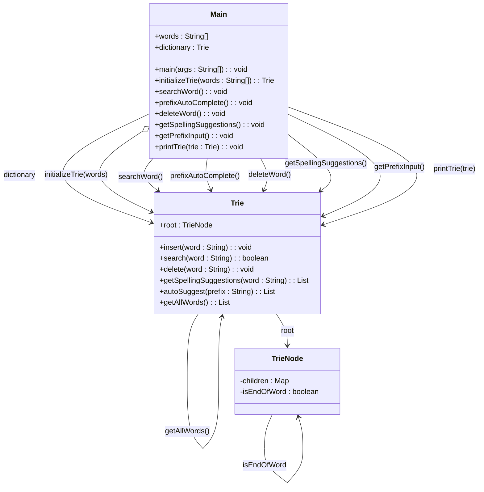

# 基础信息

|      |      |
|------|------|
| 编码语言 | .java |
| 代码路径 | auto-suggest-java-demo/src/main/java/org/example/leansoftx/Main.java |
| 包名 | org.example.leansoftx |
| 依赖项 | ['java.util.List', 'java.util.Scanner'] |
| 概述说明 | 该Java程序包含Trie字典数据结构的初始化、单词搜索、前缀自动补全、单词删除和拼写建议功能。 |

# 说明

这是一个Java程序，主要包含了一个Trie字典数据结构的多个功能。

首先，程序实现了Trie字典数据结构的初始化操作。这个数据结构主要用于存储和管理单词。通过初始化Trie字典，可以为之后的操作做好准备。

其次，程序实现了单词搜索功能。通过输入一个单词，程序能够判断该单词是否存在于Trie字典中。如果存在，返回相应的结果；如果不存在，提示用户该单词不在字典中。

第三，程序还提供了前缀自动补全的功能。通过输入一个前缀，程序可以根据Trie字典中已有的单词来进行匹配，给出所有以该前缀开头的单词作为自动补全的建议。

除此之外，程序还实现了单词删除功能。用户可以输入一个单词，程序会在Trie字典中删除该单词的记录。如果字典中不存在该单词，程序会给出相应的提示。

最后，程序还提供了拼写建议的功能。用户输入一个单词，如果该单词不在Trie字典中，程序会给出一些建议的拼写相似的单词。

总而言之，这个Java程序包含了Trie字典数据结构的初始化、单词搜索、前缀自动补全、单词删除和拼写建议等功能。通过这些功能，用户可以方便地管理和操作字典中的单词。

# 类列表 Class Summary

| 名称   | 类型  | 说明 |
|-------|------|-------------|
| Main | class | 该概要说明了一个Java程序，其中包含了一个Trie字典数据结构的初始化、单词搜索、前缀自动补全、单词删除和拼写建议等功能。 |


## 类 Main

|      |      |
|------|------|
| 访问范围 | public |
| 类型 | class |
| 名称 | Main |
| 说明 | 该概要说明了一个Java程序，其中包含了一个Trie字典数据结构的初始化、单词搜索、前缀自动补全、单词删除和拼写建议等功能。 |


### UML类图



该类图表示了一个基于Trie数据结构的单词搜索和自动补全的程序。`Main`类包含了程序的入口方法，以及其他与用户交互的方法。`Trie`类实现了Trie数据结构的各种方法，用于插入、搜索、删除、拼写建议和自动补全等操作。`TrieNode`类是Trie数据结构中的节点，包含了子节点和标记该节点是否是一个单词的结束节点的属性。

在`Main`类与`Trie`类之间存在关联关系，通过`Main`类的`dictionary`属性来实例化和使用`Trie`类。

类图中使用了继承关系（`-->`）、关联关系（`--`），并使用了合适的可见性修饰符（`+` 表示 public，`-` 表示 private）。根据提供的代码信息，类的属性和方法都在类图中体现出来。

该类图描述了一个基于Trie数据结构的单词搜索和自动补全的程序，通过插入、搜索、删除和拼写建议等功能，实现了对单词的快速查找和补全。


### 内部方法调用关系图

```mermaid
graph TD
A[Main] --> B[initializeTrie]
A --> C[searchWord]
A --> D[prefixAutoComplete]
A --> E[deleteWord]
A --> F[getSpellingSuggestions]
A --> G[getPrefixInput]
A --> H[printTrie]
B --> I[Trie.insert]
C --> H
D --> H
D --> G
E --> H
E --> I[Trie.delete]
F --> H
F --> I
F --> J[Trie.getSpellingSuggestions]
G --> H
G --> K[Trie.autoSuggest]
K --> H
H --> L[System.out]
L --> M[scanner]
M --> N[System.in]

Main是一个Java类，包含一系列处理字典的方法。initializeTrie方法用于初始化字典，接收一个字符串数组作为输入，并返回一个Trie实例。
searchWord方法以文本交互方式，接受用户输入的单词并通过字典搜索。prefixAutoComplete方法是搜索前缀匹配的单词。
deleteWord方法删除字典中的指定单词。getSpellingSuggestions方法根据输入的单词给出拼写建议。
getPrefixInput方法根据输入的前缀搜索匹配的单词，并提供Tab键切换结果的功能。
printTrie方法将字典中的所有单词打印出来。
```

### 字段列表 Field List

| 名称  | 类型  | 说明 |
|-------|-------|------|
| dictionary = initializeTrie(words) | Trie | Trie字典已通过initializeTrie方法初始化。 |
| words = {
            "as", "astronaut", "asteroid", "are", "around",
            "cat", "cars", "cares", "careful", "carefully",
            "for", "follows", "forgot", "from", "front",
            "mellow", "mean", "money", "monday", "monster",
            "place", "plan", "planet", "planets", "plans",
            "the", "their", "they", "there", "towards"
    } | String[] | 提取内容：
- 包含一个字符串数组，其中包含一些单词。

生成概要：
该信息包含一个包含多个单词的字符串数组。 |

### 方法列表 Method List

| 名称  | 类型  | 说明 |
|-------|-------|------|
| prefixAutoComplete | void | 执行函数`prefixAutoComplete()`，其中包含以下步骤：打印`dictionary`的Trie树，并获取前缀输入。 |
| getSpellingSuggestions | void | 输入一个单词，获取拼写建议，如果没有建议则显示"no suggestions found"。 |
| searchWord | void | 搜索字典中的单词并显示结果，若找到则输出相应信息，若未找到则输出相应信息。 |
| printTrie | void | 该代码段是一个打印Trie数据结构中所有单词的方法，其中包括一个字典中的单词。 |
| main | void | 该代码段展示了一个方法的调用，该方法打印了一个字典的Trie结构。方法后面注释掉了其他几个方法的调用。 |
| initializeTrie | Trie | 编写一个静态方法initializeTrie，接受字符串数组作为参数，返回一个Trie数据结构。在方法中，遍历字符串数组，逐个插入到Trie中，最后返回Trie。 |
| deleteWord | void | 该信息为一个Java程序片段，用于从字典中删除单词。用户可以输入要删除的单词，如果该单词存在于字典中，则将其删除并显示删除后的字典内容；如果该单词不存在于字典中，则显示未在字典中找到该单词。程序通过读取用户的输入实现交互功能，用户可以输入空行来退出程序。 |
| getPrefixInput | void | 该代码段是一个用于在控制台中搜索以输入的前缀开头的单词的程序。用户可以输入前缀并通过Tab键来遍历匹配的结果。程序会将用户输入的前缀作为搜索条件，并显示匹配结果。用户还可以通过退格键删除输入的字符。程序使用一个字典来进行单词匹配。当用户按下回车键时，程序退出。 |


