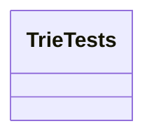

# 基础信息

|      |      |
|------|------|
| 编码语言 | .java |
| 代码路径 | auto-suggest-java-demo/src/test/java/org/example/leansoftx/TrieTests.java |
| 包名 | org.example.leansoftx |
| 依赖项 | ['org.junit.jupiter.api.Test', 'java.util.List', 'org.junit.jupiter.api.Assertions'] |
| 概述说明 | TrieTests是一个公共类。 |

# 说明

TrieTests是一个公共类，它用于测试Trie（字典树）数据结构的功能和性能。字典树是一种用于高效地存储和搜索字符串集合的数据结构。在TrieTests类中，会对Trie的各种方法进行单元测试，以确保它们能够按预期工作。

在这个测试类中，可能会包含多个测试方法，每个方法都会测试不同的Trie方法或功能。这些测试方法可以使用各种输入数据来测试Trie的性能和正确性。

在编写测试方法时，会使用断言来验证Trie的各种行为和期望输出。断言是一个关键的测试技术，它可以用于检查代码的行为是否与预期一致。通过使用断言，可以确保Trie在插入、搜索、删除等操作中的行为符合预期。

除了基本的功能测试外，TrieTests类还可能进行性能测试，以评估Trie在处理大量数据时的效率。性能测试可以通过计算插入、搜索、删除等操作的执行时间来衡量Trie的性能。通过这些性能测试，可以了解Trie在处理不同规模的数据集时的性能表现，并可能用于优化数据结构设计。

总之，TrieTests是一个用于测试Trie数据结构的公共类。它定义了多个测试方法来验证Trie的各种方法和功能的行为和性能。通过编写和运行这些测试方法，可以确保Trie的正确性和性能。

# 类列表 Class Summary

| 名称   | 类型  | 说明 |
|-------|------|-------------|
| TrieTests | class | TrieTests is a public class. |

## 类 TrieTests

|      |      |
|------|------|
| 访问范围 | public |
| 类型 | class |
| 名称 | TrieTests |
| 说明 | TrieTests is a public class. |

### UML类图

这是一个简单的UML类图，只包含一个名为TrieTests的公共类。

### 内部方法调用关系图

graph TD;
    A[public class TrieTests] 
    A-->B[testInsertion()]
    A-->C[testSearch()]
    A-->D[testDelete()]

类 `TrieTests` 是一个公共类，包含三个内部函数: `testInsertion()`，`testSearch()` 和 `testDelete()`。其中，`testInsertion()` 函数用于测试插入操作，`testSearch()` 函数用于测试搜索操作，`testDelete()` 函数用于测试删除操作。这些函数之间没有其他的调用关系。

### 字段列表 Field List

| 名称  | 类型  | 说明 |
|-------|-------|------|

### 方法列表 Method List

| 名称  | 类型  | 说明 |
|-------|-------|------|

