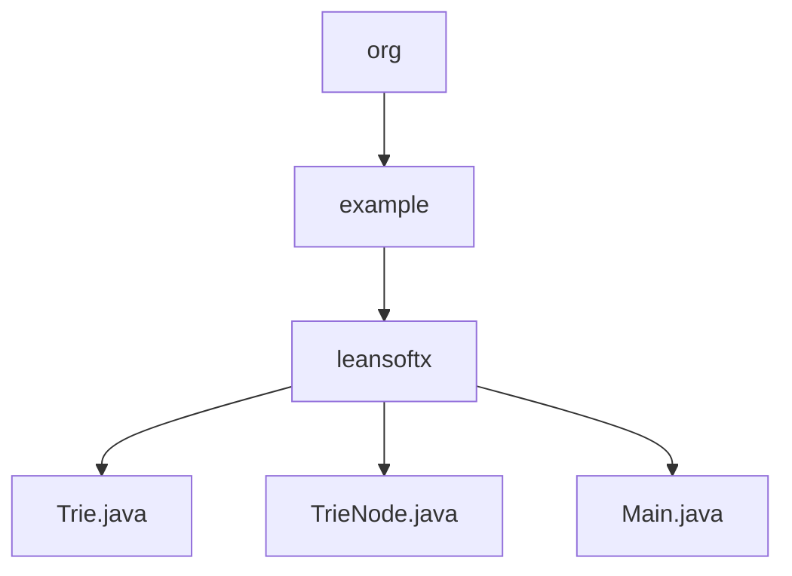

# 基础信息

|      |      |
|------|------|
| 编码语言 | .java |
| 代码路径 | auto-suggest-java-demo/src/main/java/org |
| 包名 | auto-suggest-java-demo.src.main.java.org |
| 概述说明 | Trie树实现插入、自动补全、拼写建议及结构打印功能，高效管理单词。 |

# 说明

Trie树实现包含插入、自动补全、拼写建议及结构打印功能。插入功能将单词逐字符插入树中，构建词汇结构。自动补全基于输入前缀，快速查找并返回匹配单词。拼写建议通过计算编辑距离，提供相似候选词。结构打印可视化展示Trie树层次结构，便于理解和调试。TrieNode类表示字典树节点，包含子节点映射、单词结束标志和字符值，支持查询子节点是否存在。Java程序采用Trie数据结构存储单词，具备搜索、前缀自动补全、删除和拼写建议功能，适用于快速检索和补全场景。

### 包内部结构视图

该流程图展示了 `auto-suggest-java-demo` 项目中 `src/main/java/org/example/leansoftx` 目录下的文件结构。`org` 是根目录，包含 `example` 子目录，`example` 下又包含 `leansoftx` 子目录，`leansoftx` 目录中包含 `Trie.java`、`TrieNode.java` 和 `Main.java` 三个文件。

# 文件列表 File List

| 名称   | 类型  | 说明 |
|-------|------|-------------|
| [example](example/_module.md) | package | Trie树实现插入、自动补全、拼写建议及结构打印功能，高效管理单词。 |

