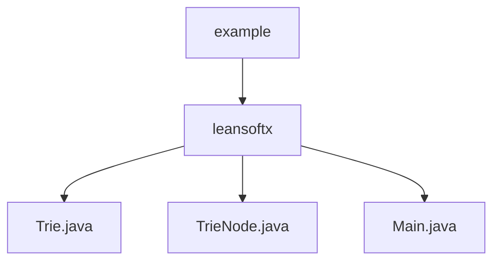

# 基础信息

|      |      |
|------|------|
| 名称 | example |
| 编码语言 | .java |
| 代码路径 | auto-suggest-java-demo/src/main/java/org/example |
| 包名 | auto-suggest-java-demo.src.main.java.org.example |
| 概述说明 | Trie类实现高效字符串处理，支持插入、搜索、删除、自动补全和拼写建议功能。 |

# 说明

## 概述

该代码模块实现了一个基于Trie（字典树）数据结构的字符串处理工具，具备高效的单词插入、搜索、删除、自动补全和拼写建议功能。Trie类通过树状结构逐字符存储单词，支持快速查找和前缀匹配。TrieNode类用于表示Trie树的节点，包含子节点映射、单词结束标志和字符值等属性。该模块适用于搜索、拼写检查和词汇管理等多种场景，能够显著提升字符串处理的效率和用户体验。

## 主要业务场景

1. **单词插入与存储**：Trie类支持高效地将单词逐字符插入到树状结构中，确保数据的快速存储和检索。
2. **单词搜索**：通过遍历Trie树，程序能够快速判断某个单词是否存在于字典中，适用于字典查找和单词验证场景。
3. **单词删除**：支持从Trie树中移除指定单词，适用于动态更新字典内容的场景。
4. **前缀自动补全**：根据用户输入的前缀，程序能够快速推荐所有可能的单词，适用于搜索框自动补全和输入提示功能。
5. **拼写建议**：在用户输入错误时，程序能够根据Trie树的特性推荐相近的正确单词，适用于拼写检查和错误纠正场景。
6. **Trie树可视化**：通过打印Trie树的结构，程序能够展示每个节点的字符及其子节点关系，适用于调试和数据结构教学场景。

### 包内部结构视图

该流程图展示了 `auto-suggest-java-demo` 项目中 `src/main/java/org/example` 目录下的文件结构。`example` 文件夹包含 `leansoftx` 子文件夹，而 `leansoftx` 文件夹中则包含 `Trie.java`、`TrieNode.java` 和 `Main.java` 三个文件。

# 文件列表 File List

| 名称   | 类型  | 说明 |
|-------|------|-------------|
| [leansoftx](leansoftx/_module.md) | package | Trie类实现高效字符串处理，支持插入、搜索、删除、自动补全和拼写建议功能。 |

