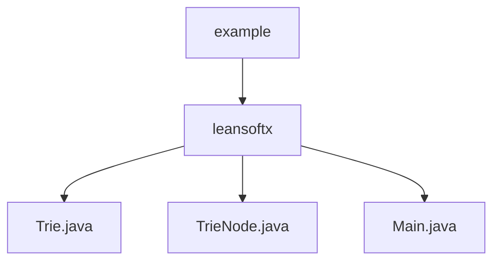

# 基础信息

|      |      |
|------|------|
| 名称 | example |
| 编码语言 | .java |
| 代码路径 | auto-suggest-java-demo/src/main/java/org/example |
| 包名 | auto-suggest-java-demo.src.main.java.org.example |
| 概述说明 | Trie树实现插入、自动补全、拼写建议和打印功能，提升文本处理效率。 |

# 说明

## 概述

该代码模块实现了一个基于Trie树的字典功能，主要包含插入、自动补全、拼写建议、删除单词和打印树结构等功能。Trie树作为一种高效的前缀树数据结构，特别适用于处理字符串的搜索、前缀匹配和自动补全场景。该模块通过Trie树存储单词，能够快速检索特定单词，并根据输入的前缀提供可能的补全建议。此外，模块还支持删除已存储的单词，确保字典内容的动态更新。拼写建议功能则基于Trie树的搜索能力，帮助用户纠正拼写错误或提供相近的词汇选项。整体设计高效且灵活，适用于多种文本处理需求。

## 主要业务场景

1. **单词插入**：支持将单词插入到Trie树中，构建字典的基础数据结构。
2. **自动补全**：根据用户输入的前缀，快速查找并返回所有匹配的单词，提升搜索效率。
3. **拼写建议**：基于Trie树的搜索能力，帮助用户纠正拼写错误或提供相近的词汇选项，提升用户体验。
4. **单词删除**：支持从Trie树中删除已存储的单词，确保字典内容的动态更新。
5. **打印树结构**：可视化展示Trie树的层次和节点关系，便于调试和理解树的结构。

这些功能共同提升了Trie树在文本处理和搜索场景中的实用性，适用于需要高效字符串处理的应用程序。

### 包内部结构视图

该流程图展示了 `auto-suggest-java-demo` 项目中 `src/main/java/org/example` 目录下的文件结构。`example` 文件夹包含 `leansoftx` 子文件夹，而 `leansoftx` 文件夹中则包含三个 Java 文件：`Trie.java`、`TrieNode.java` 和 `Main.java`。这些文件共同构成了项目的核心代码结构。

# 文件列表 File List

| 名称   | 类型  | 说明 |
|-------|------|-------------|
| [leansoftx](leansoftx/_module.md) | package | Trie树实现插入、自动补全、拼写建议和打印功能，提升文本处理效率。 |

