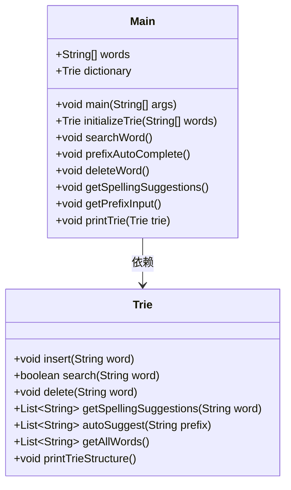
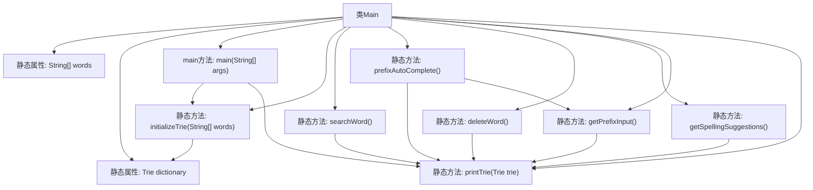

# 基础信息

|      |      |
|------|------|
| 名称 | Main |
| 编码语言 | .java |
| 代码路径 | auto-suggest-java-demo/src/main/java/org/example/leansoftx/Main.java |
| 包名 | org.example.leansoftx |
| 依赖项 | ['java.util.List', 'java.util.Scanner'] |
| 概述说明 | Java程序利用Trie结构实现字典功能，支持搜索、自动补全、删除和拼写建议。 |

# 说明

Java程序利用Trie数据结构实现字典功能，支持多种操作。包括搜索功能，用于查找特定单词是否存在；自动补全功能，根据输入前缀提示可能的单词；删除功能，允许从字典中移除单词；拼写建议功能，提供拼写错误的单词的修正建议。这些功能共同构成了一个高效且灵活的字典系统。

# 类列表 Class Summary

| 名称   | 类型  | 说明 |
|-------|------|-------------|
| Main | class | Java程序使用Trie结构实现字典功能，支持搜索、自动补全、删除和拼写建议。 |

## 类 Main

|      |      |
|------|------|
| 访问范围 | public |
| 类型 | class |
| 名称 | Main |
| 说明 | Java程序使用Trie结构实现字典功能，支持搜索、自动补全、删除和拼写建议。 |

### UML类图

**类图描述：**
该代码实现了一个基于Trie树的字典系统，包含一个`Main`类和一个`Trie`类。`Main`类负责初始化字典、打印字典结构、搜索单词、前缀自动补全、删除单词以及获取拼写建议等功能。`Trie`类则实现了Trie树的基本操作，如插入、搜索、删除、获取拼写建议、自动补全和打印Trie结构等。`Main`类依赖于`Trie`类来实现字典的核心功能。

### 内部方法调用关系图

这段代码定义了一个`Main`类，包含一个字符串数组`words`和一个`Trie`字典对象`dictionary`。`main`方法初始化了`Trie`并打印其结构。代码还提供了搜索单词、前缀自动补全、删除单词、获取拼写建议等功能。每个功能都依赖于`printTrie`方法来打印字典内容。`getPrefixInput`方法处理用户输入的前缀，并支持自动补全功能。

### 字段列表 Field List

| 名称  | 类型  | 说明 |
|-------|-------|------|
| dictionary = initializeTrie(words) | Trie | 静态字典树初始化方法调用。 |
| words = {            "as", "astronaut", "asteroid", "are", "around",            "cat", "cars", "cares", "careful", "carefully",            "for", "follows", "forgot", "from", "front",            "mellow", "mean", "money", "monday", "monster",            "place", "plan", "planet", "planets", "plans",            "the", "their", "they", "there", "towards"    } | String[] | 字符串数组包含多个单词，按字母顺序分组。 |

### 方法列表 Method List

| 名称  | 类型  | 说明 |
|-------|-------|------|
| main | void | Java主方法调用字典打印Trie结构，注释了其他功能调用。 |
| deleteWord | void | 静态方法删除字典中的单词，输入为空则退出。 |
| printTrie | void | 该方法打印字典树中所有单词，输出格式为逗号分隔。 |
| prefixAutoComplete | void | 静态方法prefixAutoComplete打印字典并获取前缀输入。 |
| getPrefixInput | void | Java方法实现前缀输入与自动补全功能，支持Tab键循环结果。 |
| getSpellingSuggestions | void | 静态方法获取拼写建议，打印字典并提示输入，输出相似单词或无建议。 |
| searchWord | void | 静态方法searchWord用于搜索字典中的单词，支持用户输入并显示结果。 |
| initializeTrie | Trie | 静态方法初始化Trie树，插入给定单词数组并返回Trie实例。 |

