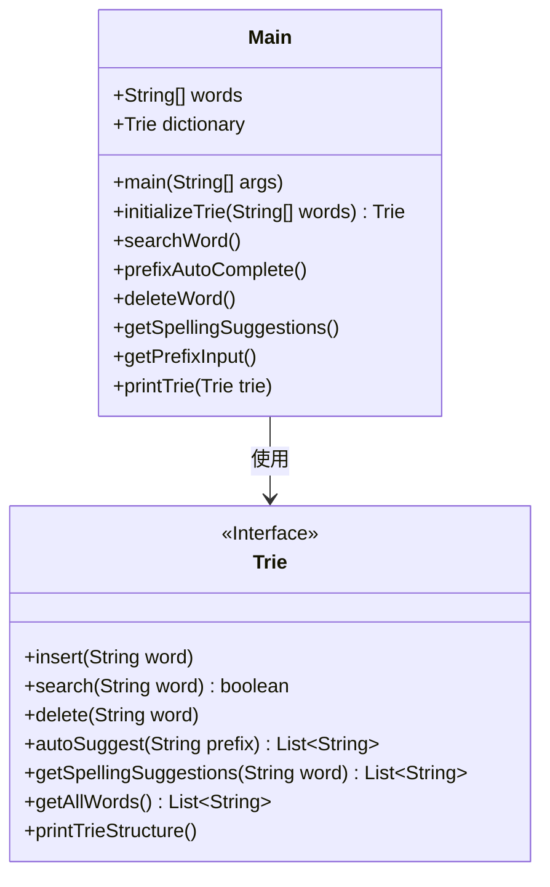
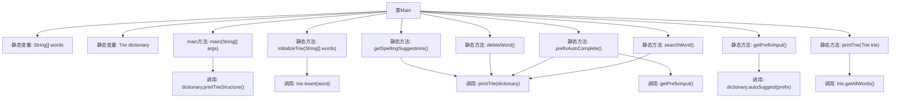

# 基础信息

|      |      |
|------|------|
| 名称 | Main |
| 编码语言 | .java |
| 代码路径 | auto-suggest-java-demo/src/main/java/org/example/leansoftx/Main.java |
| 包名 | org.example.leansoftx |
| 依赖项 | ['java.util.List', 'java.util.Scanner'] |
| 概述说明 | Java实现Trie字典树，支持插入、搜索、前缀补全和拼写建议功能。 |

# 说明

该代码实现了一个基于Trie树的字典系统，包含30个预定义单词。主要功能包括初始化字典、打印字典结构、搜索单词、前缀自动补全、删除单词和拼写建议。系统通过控制台交互，支持输入处理、退格键删除、Tab键补全和空格分隔单词。未启用的搜索和删除功能留有注释接口，自动补全功能会实时匹配前缀并循环显示建议单词。所有操作均通过Trie类的方法实现，包含异常处理机制。

# 类列表 Class Summary

| 名称   | 类型  | 说明 |
|-------|------|-------------|
| Main | class | Java代码实现字典Trie结构，支持插入、搜索、前缀补全和拼写建议功能。 |

## 类 Main

|      |      |
|------|------|
| 访问范围 | public |
| 类型 | class |
| 名称 | Main |
| 说明 | Java代码实现字典Trie结构，支持插入、搜索、前缀补全和拼写建议功能。 |

### UML类图

这段代码实现了一个基于Trie树结构的字典系统。Main类作为程序入口，包含一个预定义的单词列表和Trie字典实例，提供了字典初始化、单词搜索、前缀自动补全、单词删除和拼写建议等功能。Trie接口定义了字典的核心操作，包括插入、搜索、删除、自动建议和获取所有单词等方法。代码通过Scanner处理用户输入，实现了交互式的字典查询功能，其中getPrefixInput()方法特别实现了按Tab键循环补全的功能。整个系统展示了Trie树在字典应用中的高效性和实用性。

### 内部方法调用关系图

该流程图展示了Main类的结构及其方法调用关系。Main类包含静态变量words和dictionary，以及多个静态方法如initializeTrie、searchWord、prefixAutoComplete等。主要流程从main方法开始，调用dictionary的printTrieStructure方法。其他方法如initializeTrie通过循环调用trie.insert来初始化字典，prefixAutoComplete调用getPrefixInput实现前缀自动补全功能，printTrie则通过getAllWords输出字典内容。整体展现了字典操作的核心逻辑和数据流向。

### 字段列表 Field List

| 名称  | 类型  | 说明 |
|-------|-------|------|
| dictionary = initializeTrie(words) | Trie | 静态字典Trie树初始化 |
| words = {            "as", "astronaut", "asteroid", "are", "around",            "cat", "cars", "cares", "careful", "carefully",            "for", "follows", "forgot", "from", "front",            "mellow", "mean", "money", "monday", "monster",            "place", "plan", "planet", "planets", "plans",            "the", "their", "they", "there", "towards"    } | String[] | 单词数组包含按字母分组的常用词，如太空、汽车、金钱、星球等。 |

### 方法列表 Method List

| 名称  | 类型  | 说明 |
|-------|-------|------|
| printTrie | void | 打印字典树中的所有单词，用逗号分隔。 |
| main | void | Java主函数调用字典打印方法，其他功能被注释。 |
| prefixAutoComplete | void | 静态方法用于前缀自动补全，打印字典树并获取前缀输入。 |
| searchWord | void | 静态方法searchWord展示字典内容，循环提示输入单词并检查是否存在，空输入退出。 |
| getSpellingSuggestions | void | 静态方法getSpellingSuggestions展示字典拼写建议，输入单词后输出相似词或提示无建议。 |
| deleteWord | void | 静态方法删除字典单词，循环输入处理，未找到提示。 |
| getPrefixInput | void | Java方法：输入前缀按Tab搜索，空格继续，回车退出。 |
| initializeTrie | Trie | 静态方法初始化Trie并插入单词数组。 |

