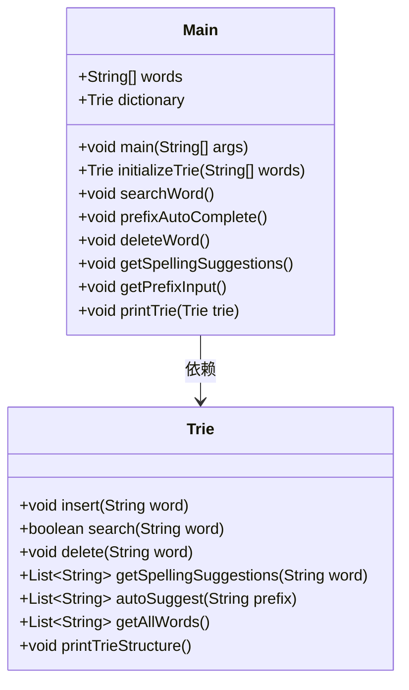
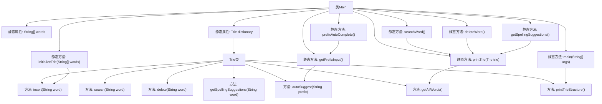

# 基础信息

|      |      |
|------|------|
| 名称 | Main |
| 编码语言 | .java |
| 代码路径 | auto-suggest-java-demo/src/main/java/org/example/leansoftx/Main.java |
| 包名 | org.example.leansoftx |
| 依赖项 | ['java.util.List', 'java.util.Scanner'] |
| 概述说明 | Java实现字典Trie，支持插入、搜索、删除、前缀补全和拼写建议。 |

# 说明

该Java程序实现了一个字典Trie结构，具备多项核心功能。首先，它支持单词的插入操作，能够将新单词高效地添加到Trie中。其次，程序提供了搜索功能，可以快速判断某个单词是否存在于字典中。此外，程序还支持单词的删除操作，能够从Trie中移除指定单词。在用户体验方面，程序实现了前缀自动补全功能，能够根据用户输入的前缀推荐可能的单词。最后，程序还具备拼写建议功能，能够在用户输入错误时提供相近的正确单词建议。这些功能共同构成了一个功能全面且高效的字典Trie结构。

# 类列表 Class Summary

| 名称   | 类型  | 说明 |
|-------|------|-------------|
| Main | class | Java程序实现字典Trie结构，支持单词插入、搜索、删除、前缀自动补全和拼写建议功能。 |

## 类 Main

|      |      |
|------|------|
| 访问范围 | public |
| 类型 | class |
| 名称 | Main |
| 说明 | Java程序实现字典Trie结构，支持单词插入、搜索、删除、前缀自动补全和拼写建议功能。 |

### UML类图

这段代码实现了一个基于Trie树（字典树）的字典管理系统。`Main`类负责初始化Trie树，并提供了一系列功能，如搜索单词、前缀自动补全、删除单词、获取拼写建议等。`Trie`类实现了Trie树的核心功能，包括插入、搜索、删除、获取拼写建议、自动补全和打印Trie结构等操作。`Main`类依赖于`Trie`类来实现这些功能。

### 内部方法调用关系图

这段代码定义了一个 `Main` 类，包含一个静态的字符串数组 `words` 和一个静态的 `Trie` 对象 `dictionary`。`Main` 类通过 `initializeTrie` 方法初始化 `Trie` 对象，并提供了多个方法用于操作 `Trie`，如搜索单词、前缀自动补全、删除单词和获取拼写建议等。`Trie` 类包含了插入、搜索、删除、获取拼写建议、自动补全和获取所有单词等方法。`Main` 类的 `main` 方法调用了 `printTrieStructure` 方法来打印 `Trie` 结构。整个代码的核心是 `Trie` 数据结构的操作，用于高效地存储和检索单词。

### 字段列表 Field List

| 名称  | 类型  | 说明 |
|-------|-------|------|
| dictionary = initializeTrie(words) | Trie | 静态Trie字典初始化方法调用。 |
| words = {            "as", "astronaut", "asteroid", "are", "around",            "cat", "cars", "cares", "careful", "carefully",            "for", "follows", "forgot", "from", "front",            "mellow", "mean", "money", "monday", "monster",            "place", "plan", "planet", "planets", "plans",            "the", "their", "they", "there", "towards"    } | String[] | 包含常见英文单词的字符串数组，涉及多种主题和词性。 |

### 方法列表 Method List

| 名称  | 类型  | 说明 |
|-------|-------|------|
| deleteWord | void | 删除字典中指定单词，未找到则提示。 |
| prefixAutoComplete | void | 静态方法prefixAutoComplete打印字典并获取前缀输入。 |
| initializeTrie | Trie | 静态方法初始化Trie树，插入给定单词数组。 |
| printTrie | void | 该方法打印Trie树中所有单词，输出格式为逗号分隔的列表。 |
| searchWord | void | 静态方法搜索单词，打印字典树，循环输入并检查是否存在。 |
| getPrefixInput | void | Java方法实现前缀搜索，支持Tab循环结果，Enter退出。 |
| getSpellingSuggestions | void | 静态方法获取拼写建议，输入单词后输出相似词，无输入则退出。 |
| main | void | Java主方法调用字典结构打印，注释掉搜索、自动补全、删除和拼写建议功能。 |

