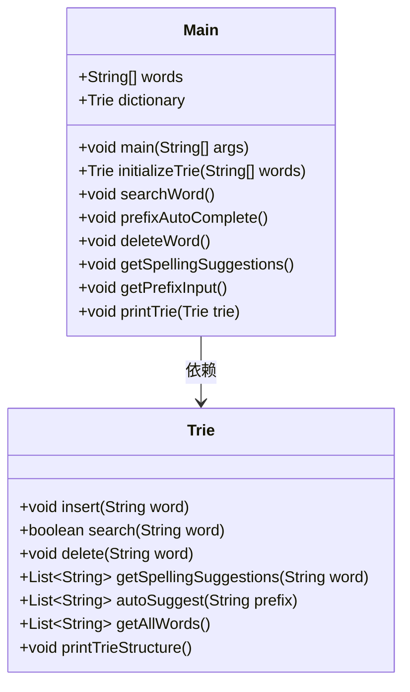
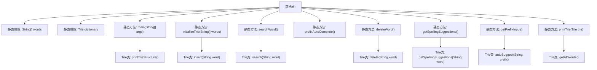

# 基础信息

|      |      |
|------|------|
| 名称 | Main |
| 编码语言 | .java |
| 代码路径 | auto-suggest-java-demo/src/main/java/org/example/leansoftx/Main.java |
| 包名 | org.example.leansoftx |
| 依赖项 | ['java.util.List', 'java.util.Scanner'] |
| 概述说明 | Java利用Trie实现字典功能，支持搜索、补全、删除和拼写建议。 |

# 说明

Java程序利用Trie数据结构实现了字典功能，具备单词搜索、前缀自动补全、删除单词和拼写建议等核心功能。Trie结构高效支持字符串的插入、查询和删除操作，特别适用于处理前缀匹配和自动补全场景。该程序通过Trie树存储单词，能够快速检索特定单词，并根据输入的前缀提供可能的补全建议。此外，程序还支持删除已存储的单词，确保字典内容的动态更新。拼写建议功能则基于Trie树的搜索能力，帮助用户纠正拼写错误或提供相近的词汇选项。整体设计高效且灵活，适用于多种文本处理需求。

# 类列表 Class Summary

| 名称   | 类型  | 说明 |
|-------|------|-------------|
| Main | class | Java程序使用Trie数据结构实现字典功能，支持单词搜索、前缀自动补全、删除单词和拼写建议。 |

## 类 Main

|      |      |
|------|------|
| 访问范围 | public |
| 类型 | class |
| 名称 | Main |
| 说明 | Java程序使用Trie数据结构实现字典功能，支持单词搜索、前缀自动补全、删除单词和拼写建议。 |

### UML类图

这段代码定义了一个 `Main` 类，其中包含一个静态的 `Trie` 字典对象 `dictionary`，用于存储一组预定义的单词。`Main` 类提供了多个方法，包括初始化字典、搜索单词、前缀自动补全、删除单词、获取拼写建议以及打印字典内容等。`Trie` 类则实现了字典的核心功能，如插入、搜索、删除、获取拼写建议、自动补全和获取所有单词等。`Main` 类依赖于 `Trie` 类来实现其功能。

### 内部方法调用关系图

**描述：**
该代码定义了一个`Main`类，其中包含一个静态字符串数组`words`和一个静态`Trie`对象`dictionary`。`Main`类提供了多个静态方法，包括初始化Trie树、搜索单词、前缀自动补全、删除单词、获取拼写建议等功能。`Trie`类负责实现字典树的相关操作，如插入、搜索、删除、获取拼写建议、自动补全和打印Trie结构等。代码通过`main`方法启动，首先初始化Trie树并打印其结构，其他功能方法被注释掉，但可以通过取消注释来调用。

### 字段列表 Field List

| 名称  | 类型  | 说明 |
|-------|-------|------|
| dictionary = initializeTrie(words) | Trie | 静态Trie字典初始化，用于存储单词。 |
| words = {            "as", "astronaut", "asteroid", "are", "around",            "cat", "cars", "cares", "careful", "carefully",            "for", "follows", "forgot", "from", "front",            "mellow", "mean", "money", "monday", "monster",            "place", "plan", "planet", "planets", "plans",            "the", "their", "they", "there", "towards"    } | String[] | 包含以a、c、f、m、p、t开头的常用英文单词。 |

### 方法列表 Method List

| 名称  | 类型  | 说明 |
|-------|-------|------|
| printTrie | void | 打印字典中所有单词，用逗号分隔。 |
| initializeTrie | Trie | 初始化Trie树并插入给定单词数组。 |
| deleteWord | void | 删除字典中指定单词，未找到时提示。 |
| prefixAutoComplete | void | 静态方法实现前缀自动补全，打印字典并获取前缀输入。 |
| main | void | Java主方法调用字典打印Trie结构。 |
| getSpellingSuggestions | void | 静态方法获取拼写建议，打印字典并提示输入单词，输出相似单词或提示无建议。 |
| searchWord | void | 静态方法搜索单词，打印字典，循环输入单词，空输入退出，未找到提示。 |
| getPrefixInput | void | 获取前缀输入，支持Tab循环搜索，空格继续，退格删除，回车退出。 |

