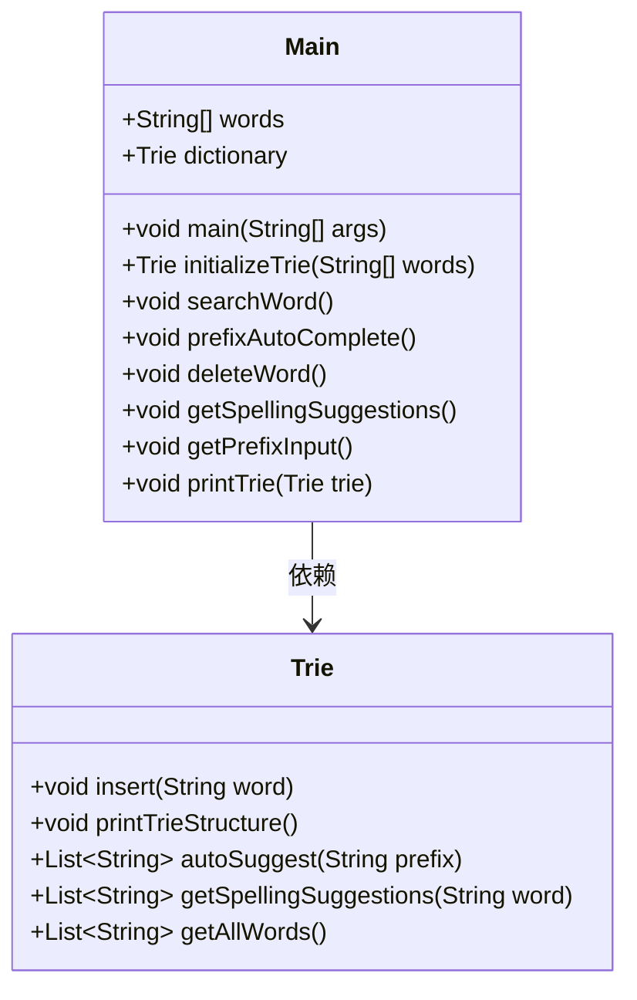
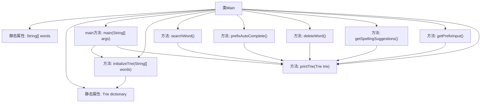

# 基础信息

|      |      |
|------|------|
| 编码语言 | .java |
| 代码路径 | auto-suggest-java-demo/src/main/java/org/example/leansoftx/Main.java |
| 包名 | org.example.leansoftx |
| 依赖项 | ['java.util.List', 'java.util.Scanner'] |
| 概述说明 | Java程序利用Trie结构实现单词存储，支持搜索、补全、删除及拼写建议。 |

# 说明

Java程序采用Trie数据结构存储单词，具备搜索、前缀自动补全、删除和拼写建议功能。搜索功能可快速查找单词是否存在，前缀自动补全根据输入前缀提供可能的单词建议，删除功能支持从结构中移除指定单词，拼写建议则在用户输入错误时提供相近的正确单词推荐。该程序通过Trie结构高效管理单词，适用于需要快速检索和补全的场景。

# 类列表 Class Summary

| 名称   | 类型  | 说明 |
|-------|------|-------------|
| Main | class | Java程序使用Trie结构存储单词，支持搜索、前缀自动补全、删除和拼写建议功能。 |

## 类 Main

|      |      |
|------|------|
| 访问范围 | public |
| 类型 | class |
| 名称 | Main |
| 说明 | Java程序使用Trie结构存储单词，支持搜索、前缀自动补全、删除和拼写建议功能。 |

### UML类图

这段代码定义了一个 `Main` 类，其中包含一个字符串数组 `words` 和一个 `Trie` 类型的字典对象 `dictionary`。`Main` 类提供了多个方法，如 `initializeTrie` 用于初始化字典，`searchWord` 用于搜索单词，`prefixAutoComplete` 用于前缀自动补全，`deleteWord` 用于删除单词，`getSpellingSuggestions` 用于获取拼写建议，`getPrefixInput` 用于获取前缀输入，`printTrie` 用于打印字典内容。`Trie` 类则提供了插入单词、打印字典结构、自动建议、获取拼写建议和获取所有单词的方法。`Main` 类依赖于 `Trie` 类来实现字典功能。

### 内部方法调用关系图

这段代码定义了一个`Main`类，其中包含一个静态的单词数组`words`和一个静态的`Trie`字典`dictionary`。`main`方法初始化了字典并打印了字典结构。代码中还包含了多个方法，如`searchWord`、`prefixAutoComplete`、`deleteWord`、`getSpellingSuggestions`和`getPrefixInput`，这些方法分别用于搜索单词、前缀自动补全、删除单词、获取拼写建议和处理前缀输入。`printTrie`方法用于打印字典中的所有单词。流程图展示了类内部各方法之间的调用关系。

### 字段列表 Field List

| 名称  | 类型  | 说明 |
|-------|-------|------|
| words = {
            "as", "astronaut", "asteroid", "are", "around",
            "cat", "cars", "cares", "careful", "carefully",
            "for", "follows", "forgot", "from", "front",
            "mellow", "mean", "money", "monday", "monster",
            "place", "plan", "planet", "planets", "plans",
            "the", "their", "they", "there", "towards"
    } | String[] | 包含多个英文单词的字符串数组，涵盖不同主题和长度。 |
| dictionary = initializeTrie(words) | Trie | 静态Trie字典通过初始化单词列表生成。 |

### 方法列表 Method List

| 名称  | 类型  | 说明 |
|-------|-------|------|
| prefixAutoComplete | void | 静态方法实现前缀自动补全功能。 |
| deleteWord | void | 静态方法删除字典中的单词，输入空则退出。 |
| initializeTrie | Trie | 静态方法初始化Trie，插入给定单词数组后返回Trie实例。 |
| printTrie | void | 打印字典树中的所有单词，以逗号分隔。 |
| getSpellingSuggestions | void | 该方法打印字典并提示输入单词以获取拼写建议，若无输入则退出。 |
| main | void | 主函数调用字典结构打印方法，其他功能注释未启用。 |
| searchWord | void | 静态方法搜索单词，输入空则退出，未找到提示。 |
| getPrefixInput | void | Java方法实现前缀输入搜索，支持Tab循环结果和空格分隔。 |

