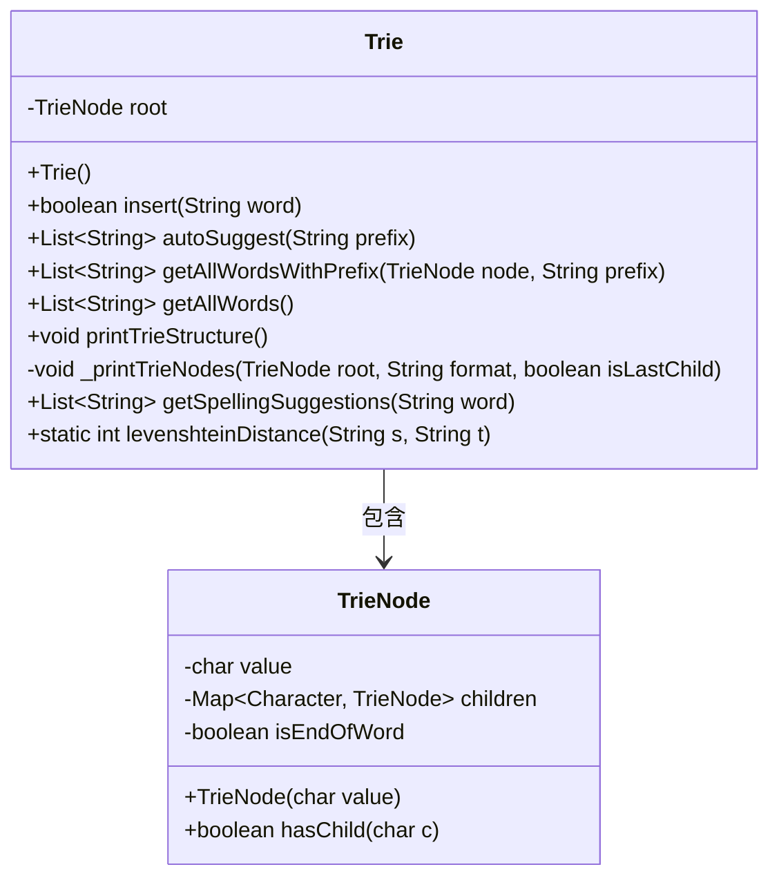
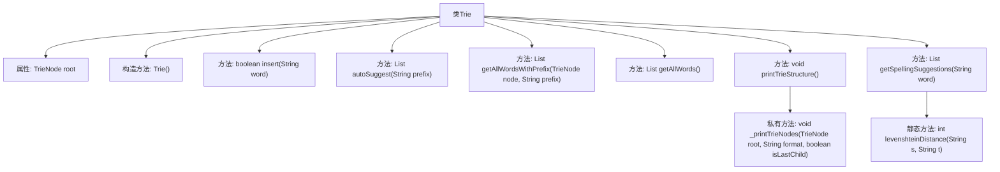

# 基础信息

|      |      |
|------|------|
| 名称 | Trie |
| 编码语言 | .java |
| 代码路径 | auto-suggest-java-demo/src/main/java/org/example/leansoftx/Trie.java |
| 包名 | org.example.leansoftx |
| 依赖项 | ['java.util'] |
| 概述说明 | Trie树支持插入、自动补全、拼写建议和打印树结构。 |

# 说明

Trie树实现提供了插入、自动补全、拼写建议和打印树结构的功能。插入操作允许将单词添加到树中，自动补全功能可以根据前缀快速查找匹配的单词，拼写建议则帮助纠正拼写错误，打印树结构功能用于可视化展示树的层次和节点关系。这些功能共同提升了Trie树在文本处理和搜索场景中的实用性。

# 类列表 Class Summary

| 名称   | 类型  | 说明 |
|-------|------|-------------|
| Trie | class | Trie树实现，支持插入、自动补全、拼写建议和打印树结构。 |

## 类 Trie

|      |      |
|------|------|
| 访问范围 | public |
| 类型 | class |
| 名称 | Trie |
| 说明 | Trie树实现，支持插入、自动补全、拼写建议和打印树结构。 |

### UML类图

这段代码定义了一个`Trie`类，用于实现字典树（Trie）数据结构。`Trie`类包含一个`TrieNode`类的实例作为根节点，并提供了插入单词、自动补全、获取所有单词、打印树结构、拼写建议等功能。`TrieNode`类表示字典树的节点，包含字符值、子节点映射和标记是否为单词结尾的属性。`Trie`类通过`TrieNode`类构建树结构，并提供了多种操作方法来处理字符串数据。

### 内部方法调用关系图

这段代码实现了一个Trie（前缀树）数据结构，用于高效地存储和检索字符串。Trie类包含插入单词、自动补全、获取所有单词、打印Trie结构、拼写建议等功能。`insert`方法用于插入单词，`autoSuggest`方法用于根据前缀自动补全单词，`getAllWordsWithPrefix`方法用于获取指定前缀的所有单词，`printTrieStructure`方法用于打印Trie的结构，`getSpellingSuggestions`方法用于根据Levenshtein距离提供拼写建议，`levenshteinDistance`方法用于计算两个字符串之间的编辑距离。

### 字段列表 Field List

| 名称  | 类型  | 说明 |
|-------|-------|------|
| root | TrieNode | 私有TrieNode根节点。 |

### 方法列表 Method List

| 名称  | 类型  | 说明 |
|-------|-------|------|
| levenshteinDistance | int | 计算字符串s和t之间的编辑距离。 |
| getAllWordsWithPrefix | List<String> | 方法返回指定前缀的所有单词列表。 |
| autoSuggest | List<String> | 方法通过前缀在Trie树中查找匹配的单词列表。 |
| getSpellingSuggestions | List<String> | 方法根据前缀和编辑距离返回拼写建议列表。 |
| _printTrieNodes | void | 递归打印Trie树节点，格式化输出子节点。 |
| insert | boolean | 插入单词到Trie树，若已存在则返回false，否则返回true。 |
| getAllWords | List<String> | 该方法返回从根节点开始的所有单词列表。 |
| printTrieStructure | void | 该方法打印Trie结构，从根节点开始递归输出所有节点。 |

