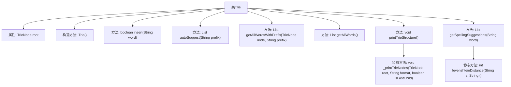

# 基础信息

|      |      |
|------|------|
| 编码语言 | .java |
| 代码路径 | auto-suggest-java-demo/src/main/java/org/example/leansoftx/Trie.java |
| 包名 | org.example.leansoftx |
| 依赖项 | ['java.util'] |
| 概述说明 | Trie树实现插入、自动补全、拼写建议及打印功能。 |

# 说明

Trie树实现包含插入、自动补全、拼写建议及结构打印功能。插入功能用于将单词逐字符插入树中，构建词汇结构。自动补全功能基于输入前缀，快速查找并返回所有匹配的单词。拼写建议功能通过计算编辑距离，提供与输入单词相似的候选词。结构打印功能则用于可视化展示Trie树的层次结构，便于理解和调试。这些功能共同构成了一个高效且实用的Trie树实现。

# 类列表 Class Summary

| 名称   | 类型  | 说明 |
|-------|------|-------------|
| Trie | class | Trie树实现插入、自动补全、拼写建议及结构打印功能。 |

## 类 Trie

|      |      |
|------|------|
| 访问范围 | public |
| 类型 | class |
| 名称 | Trie |
| 说明 | Trie树实现插入、自动补全、拼写建议及结构打印功能。 |

### UML类图

类图描述：
`Trie` 类实现了一个字典树数据结构，用于高效存储和检索字符串。`Trie` 类包含一个 `TrieNode` 类型的根节点，提供了插入、自动补全、获取所有单词、打印树结构、拼写建议等功能。`TrieNode` 类表示字典树的节点，包含字符值、子节点映射以及标记是否为单词结尾的布尔值。`Trie` 类依赖于 `TrieNode` 类来构建和操作字典树。

### 内部方法调用关系图

这段代码实现了一个Trie（前缀树）数据结构，用于高效存储和检索字符串。Trie类包含插入单词、自动补全、获取所有单词、打印Trie结构、拼写建议等功能。`insert`方法用于插入单词，`autoSuggest`方法根据前缀提供自动补全建议，`getAllWordsWithPrefix`方法获取所有以特定前缀开头的单词，`printTrieStructure`方法打印Trie的结构，`getSpellingSuggestions`方法提供拼写建议，`levenshteinDistance`方法计算两个字符串之间的编辑距离。

### 字段列表 Field List

| 名称  | 类型  | 说明 |
|-------|-------|------|
| root | TrieNode | 私有成员变量root，类型为TrieNode。 |

### 方法列表 Method List

| 名称  | 类型  | 说明 |
|-------|-------|------|
| getAllWordsWithPrefix | List<String> | 方法返回以指定前缀开头的所有单词列表。 |
| getAllWords | List<String> | 该方法返回以根节点为起点的所有单词列表。 |
| levenshteinDistance | int | 计算字符串s和t的编辑距离，返回最小操作次数。 |
| printTrieStructure | void | 打印Trie结构，显示根节点及子节点。 |
| _printTrieNodes | void | 递归打印Trie树节点，显示层级和子节点关系。 |
| getSpellingSuggestions | List<String> | 获取拼写建议，基于前缀和编辑距离筛选相似词。 |
| autoSuggest | List<String> | 方法根据前缀在Trie树中查找并返回匹配的单词列表。 |
| insert | boolean | Trie树插入单词方法，逐字符检查并插入，返回插入成功与否。 |

