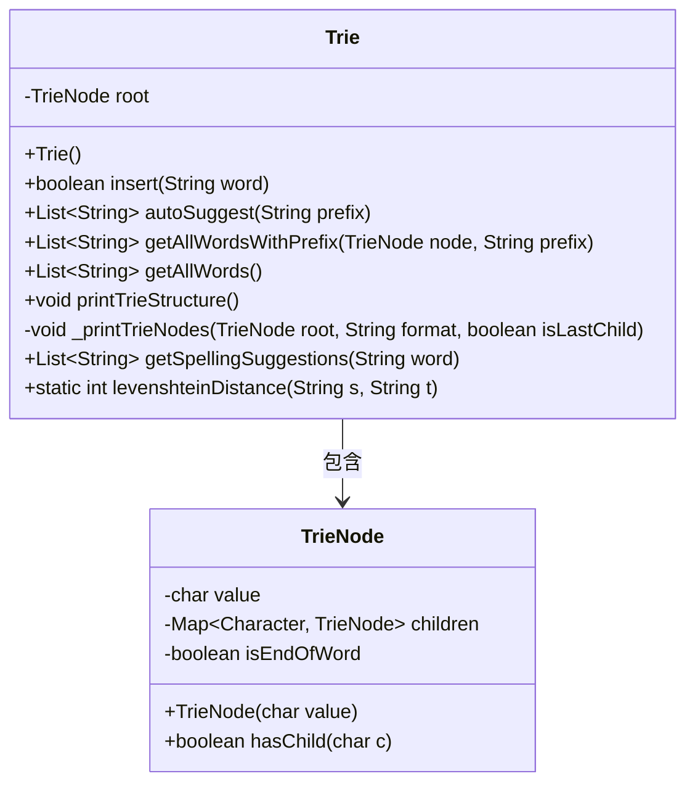
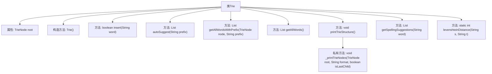

# 基础信息

|      |      |
|------|------|
| 名称 | Trie |
| 编码语言 | .java |
| 代码路径 | auto-suggest-java-demo/src/main/java/org/example/leansoftx/Trie.java |
| 包名 | org.example.leansoftx |
| 依赖项 | ['java.util'] |
| 概述说明 | Trie类支持插入、自动建议、拼写建议和打印结构功能。 |

# 说明

Trie类实现了插入、自动建议、拼写建议和打印Trie结构功能。插入功能用于将字符串添加到Trie中，自动建议功能根据输入前缀提供可能的完整字符串建议，拼写建议功能用于纠正输入中的拼写错误并提供正确的字符串建议，打印Trie结构功能则用于可视化Trie的内部结构，展示节点及其连接关系。这些功能共同构成了一个高效的字符串处理工具。

# 类列表 Class Summary

| 名称   | 类型  | 说明 |
|-------|------|-------------|
| Trie | class | Trie类实现插入、自动建议、拼写建议和打印Trie结构功能。 |

## 类 Trie

|      |      |
|------|------|
| 访问范围 | public |
| 类型 | class |
| 名称 | Trie |
| 说明 | Trie类实现插入、自动建议、拼写建议和打印Trie结构功能。 |

### UML类图

### 描述
该代码实现了一个Trie（前缀树）数据结构，用于高效存储和检索字符串。`Trie`类包含插入单词、自动补全、获取所有单词、打印Trie结构、拼写建议等功能。`TrieNode`类表示Trie的节点，包含字符值、子节点映射和是否单词结束的标志。`Trie`类依赖于`TrieNode`类来构建和操作Trie树。

### 内部方法调用关系图

这段代码定义了一个Trie（前缀树）数据结构，用于高效地存储和检索字符串。Trie类包含插入、自动补全、获取所有单词、打印Trie结构、拼写建议等功能。`insert`方法用于插入单词，`autoSuggest`方法用于根据前缀自动补全单词，`getAllWordsWithPrefix`方法用于获取以特定前缀开头的所有单词，`getAllWords`方法用于获取所有单词，`printTrieStructure`方法用于打印Trie的结构，`getSpellingSuggestions`方法用于根据Levenshtein距离提供拼写建议，`levenshteinDistance`方法用于计算两个字符串之间的编辑距离。

### 字段列表 Field List

| 名称  | 类型  | 说明 |
|-------|-------|------|
| root | TrieNode | 私有成员变量root，类型为TrieNode。 |

### 方法列表 Method List

| 名称  | 类型  | 说明 |
|-------|-------|------|
| levenshteinDistance | int | 计算字符串s和t之间的编辑距离。 |
| autoSuggest | List<String> | 该方法根据前缀在字典树中查找并返回所有匹配的单词。 |
| getAllWordsWithPrefix | List<String> | 方法返回以指定前缀开头的所有单词列表。 |
| printTrieStructure | void | 打印Trie树结构，从根节点开始递归输出所有节点。 |
| getAllWords | List<String> | 方法返回以指定前缀开头的所有单词列表。 |
| getSpellingSuggestions | List<String> | 方法返回与输入词拼写相似且编辑距离小于等于2的单词列表。 |
| insert | boolean | Trie树插入单词方法，遍历字符并创建节点，标记单词结束。 |
| _printTrieNodes | void | 递归打印Trie树节点，格式化显示层级关系。 |

