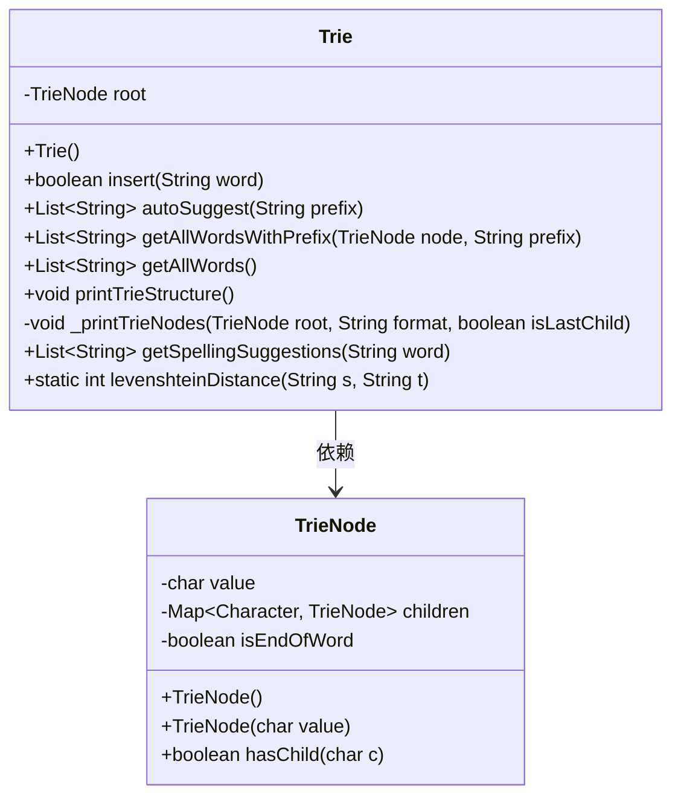
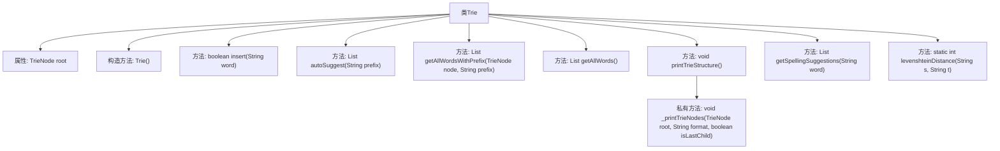

# 基础信息

|      |      |
|------|------|
| 名称 | Trie |
| 编码语言 | .java |
| 代码路径 | auto-suggest-java-demo/src/main/java/org/example/leansoftx/Trie.java |
| 包名 | org.example.leansoftx |
| 依赖项 | ['java.util'] |
| 概述说明 | Trie类支持插入、自动补全、拼写建议和打印功能。 |

# 说明

Trie类实现了一个高效的数据结构，支持插入操作，能够将单词逐字符存储，形成树状结构。自动补全功能通过遍历Trie树，快速找到以指定前缀开头的所有单词。拼写建议功能利用Trie树的特性，根据输入的部分字符推荐可能的完整单词。打印结构功能则用于可视化Trie树的层次结构，展示每个节点的字符及其子节点关系。这些功能共同构成了一个强大的字符串处理工具，适用于搜索、拼写检查和词汇管理等多种场景。

# 类列表 Class Summary

| 名称   | 类型  | 说明 |
|-------|------|-------------|
| Trie | class | Trie类实现插入、自动补全、拼写建议和打印结构功能。 |

## 类 Trie

|      |      |
|------|------|
| 访问范围 | public |
| 类型 | class |
| 名称 | Trie |
| 说明 | Trie类实现插入、自动补全、拼写建议和打印结构功能。 |

### UML类图

这段代码定义了一个`Trie`类，用于实现字典树（Trie）数据结构。`Trie`类包含一个`TrieNode`类型的根节点，提供了插入单词、自动补全、获取所有单词、打印树结构、拼写建议等功能。`TrieNode`类表示字典树的节点，包含字符值、子节点映射以及是否单词结束的标志。`Trie`类通过依赖`TrieNode`类来构建和操作字典树。

### 内部方法调用关系图

这段代码定义了一个`Trie`类，用于实现字典树数据结构。`Trie`类包含多个方法，如插入单词、自动补全、获取所有单词、打印字典树结构、拼写建议以及计算两个字符串之间的编辑距离。`Trie`类的核心是通过`TrieNode`节点来构建树结构，并通过递归方法`_printTrieNodes`来打印树的层次结构。`levenshteinDistance`方法用于计算两个字符串之间的编辑距离，以便在拼写建议中使用。整体代码结构清晰，功能明确，适合用于处理字符串相关的问题。

### 字段列表 Field List

| 名称  | 类型  | 说明 |
|-------|-------|------|
| root | TrieNode | 私有TrieNode根节点声明。 |

### 方法列表 Method List

| 名称  | 类型  | 说明 |
|-------|-------|------|
| autoSuggest | List<String> | 方法根据前缀查找匹配的单词列表。 |
| getAllWordsWithPrefix | List<String> | 方法返回指定前缀的所有单词列表。 |
| _printTrieNodes | void | 递归打印Trie树节点，格式化输出子节点关系。 |
| printTrieStructure | void | 该方法打印Trie树结构，从根节点开始递归输出所有节点。 |
| getAllWords | List<String> | 方法getAllWords返回以指定前缀开头的所有单词列表。 |
| insert | boolean | 插入单词到Trie树，若已存在返回false，否则插入并返回true。 |
| levenshteinDistance | int | 计算两个字符串的编辑距离，返回最小操作次数。 |
| getSpellingSuggestions | List<String> | 获取拼写建议：根据前缀和编辑距离筛选相近词。 |

