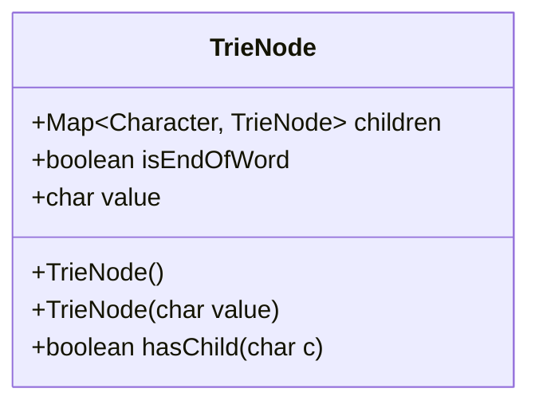
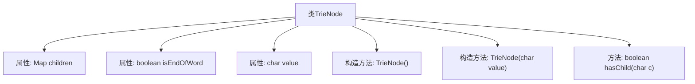

# 基础信息

|      |      |
|------|------|
| 名称 | TrieNode |
| 编码语言 | .java |
| 代码路径 | auto-suggest-java-demo/src/main/java/org/example/leansoftx/TrieNode.java |
| 包名 | org.example.leansoftx |
| 依赖项 | ['java.util.HashMap', 'java.util.Map'] |
| 概述说明 | TrieNode类含子节点映射、结束标志和字符值，支持查询子节点。 |

# 说明

TrieNode类是一个用于构建Trie树的数据结构，主要包含三个关键属性。首先，它拥有一个子节点映射，用于存储当前节点的子节点，通常以字符为键，对应的TrieNode为值。其次，它包含一个单词结束标志，用于标记当前节点是否代表一个完整单词的结束。最后，它存储了当前节点的字符值，表示该节点对应的字符。此外，TrieNode类支持查询某个子节点是否存在，通过检查子节点映射中是否包含该字符键来实现。

# 类列表 Class Summary

| 名称   | 类型  | 说明 |
|-------|------|-------------|
| TrieNode | class | TrieNode类包含子节点映射、单词结束标志和字符值，支持查询子节点存在。 |

## 类 TrieNode

|      |      |
|------|------|
| 访问范围 | public |
| 类型 | class |
| 名称 | TrieNode |
| 说明 | TrieNode类包含子节点映射、单词结束标志和字符值，支持查询子节点存在。 |

### UML类图

**描述：**  
`TrieNode`类表示字典树中的一个节点，包含一个字符值`value`、一个映射`children`用于存储子节点，以及一个布尔值`isEndOfWord`标记是否为一个单词的结束。类提供了两个构造函数，分别用于初始化节点和带字符值的节点，并提供了一个方法`hasChild`用于检查是否存在指定字符的子节点。

### 内部方法调用关系图

该流程图描述了`TrieNode`类的结构及其内部关系。`TrieNode`类包含三个属性：`children`、`isEndOfWord`和`value`，以及两个构造方法和一个`hasChild`方法。构造方法用于初始化`children`和`isEndOfWord`属性，并可选择性地设置`value`属性。`hasChild`方法用于检查`children`映射中是否包含指定的字符键。

### 字段列表 Field List

| 名称  | 类型  | 说明 |
|-------|-------|------|
| children | Map<Character, TrieNode> | 定义了一个字符到TrieNode的映射，用于存储子节点。 |
| value = ' ' | char | 定义字符变量value并初始化为空格。 |
| isEndOfWord | boolean | 该布尔变量表示是否到达单词结尾。 |

### 方法列表 Method List

| 名称  | 类型  | 说明 |
|-------|-------|------|
| hasChild | boolean | 检查字符c是否为子节点。 |

