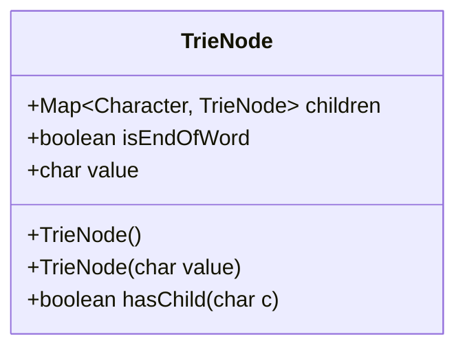
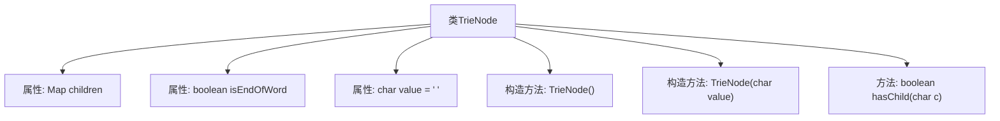

# 基础信息

|      |      |
|------|------|
| 编码语言 | .java |
| 代码路径 | auto-suggest-java-demo/src/main/java/org/example/leansoftx/TrieNode.java |
| 包名 | org.example.leansoftx |
| 依赖项 | ['java.util.HashMap', 'java.util.Map'] |
| 概述说明 | TrieNode类含子节点映射、单词结束标志和字符值，支持查询子节点。 |

# 说明

TrieNode类是一个用于表示字典树节点的数据结构。它包含三个主要属性：子节点映射、单词结束标志和字符值。子节点映射用于存储当前节点的所有子节点，通常以字符为键，对应的TrieNode为值。单词结束标志是一个布尔值，用于标记当前节点是否为一个单词的结尾。字符值存储当前节点代表的字符。该类支持查询子节点是否存在，通过检查子节点映射中是否包含指定字符对应的节点。这种结构使得TrieNode类能够高效地支持字典树的插入、查找和删除操作。

# 类列表 Class Summary

| 名称   | 类型  | 说明 |
|-------|------|-------------|
| TrieNode | class | TrieNode类包含子节点映射、单词结束标志和字符值，支持查询子节点存在。 |

## 类 TrieNode

|      |      |
|------|------|
| 访问范围 | public |
| 类型 | class |
| 名称 | TrieNode |
| 说明 | TrieNode类包含子节点映射、单词结束标志和字符值，支持查询子节点存在。 |

### UML类图

这段代码定义了一个`TrieNode`类，用于表示字典树（Trie）中的一个节点。每个节点包含一个`children`映射，用于存储子节点，一个`isEndOfWord`标志，表示当前节点是否是一个单词的结束，以及一个`value`字符，表示当前节点的值。类中提供了两个构造函数，分别用于初始化节点和带字符值的节点，以及一个`hasChild`方法，用于检查当前节点是否包含某个字符的子节点。

### 内部方法调用关系图

这段代码定义了一个名为 `TrieNode` 的类，用于表示字典树（Trie）中的一个节点。该类包含三个属性：`children` 用于存储子节点，`isEndOfWord` 用于标记当前节点是否为单词的结尾，`value` 用于存储当前节点的字符值。类中提供了两个构造方法：一个无参构造方法用于初始化 `children` 和 `isEndOfWord`，另一个构造方法允许指定 `value`。此外，类中还包含一个 `hasChild` 方法，用于检查当前节点是否包含指定字符的子节点。

### 字段列表 Field List

| 名称  | 类型  | 说明 |
|-------|-------|------|
| isEndOfWord | boolean | 判断是否为单词结尾的布尔值。 |
| value = ' ' | char | 定义了一个公共字符变量value，初始值为空格。 |
| children | Map<Character, TrieNode> | 公共字符映射到Trie节点的子节点集合。 |

### 方法列表 Method List

| 名称  | 类型  | 说明 |
|-------|-------|------|
| hasChild | boolean | 检查字符c是否为子节点。 |

