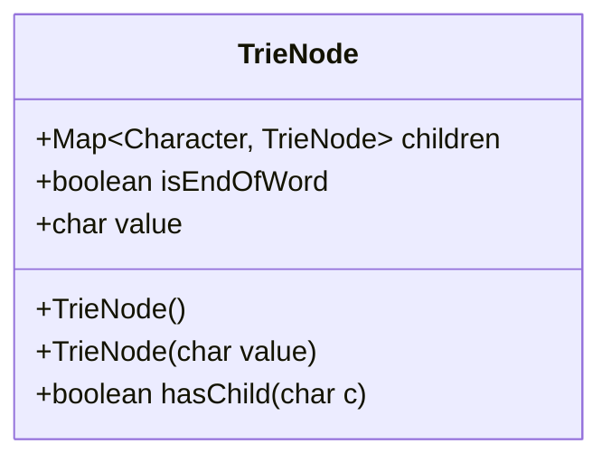
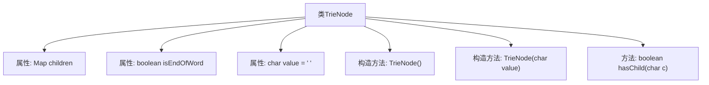

# 基础信息

|      |      |
|------|------|
| 名称 | TrieNode |
| 编码语言 | .java |
| 代码路径 | auto-suggest-java-demo/src/main/java/org/example/leansoftx/TrieNode.java |
| 包名 | org.example.leansoftx |
| 依赖项 | ['java.util.HashMap', 'java.util.Map'] |
| 概述说明 | TrieNode类含字符映射、结束标志、字符值，支持初始化、字符检查、子节点查询。 |

# 说明

TrieNode类是一个用于表示字典树节点的数据结构，包含字符映射子节点、结束标志和字符值三个主要属性。该类支持初始化操作，能够检查特定字符是否存在，并提供查询子节点的功能。这些特性使得TrieNode类在处理字符串匹配和前缀搜索等场景中具有高效性和灵活性。

# 类列表 Class Summary

| 名称   | 类型  | 说明 |
|-------|------|-------------|
| TrieNode | class | TrieNode类包含字符映射子节点、结束标志和字符值，支持初始化、字符检查和子节点查询。 |

## 类 TrieNode

|      |      |
|------|------|
| 访问范围 | public |
| 类型 | class |
| 名称 | TrieNode |
| 说明 | TrieNode类包含字符映射子节点、结束标志和字符值，支持初始化、字符检查和子节点查询。 |

### UML类图

这段代码定义了一个`TrieNode`类，用于表示字典树（Trie）中的一个节点。每个`TrieNode`包含一个`children`映射，用于存储子节点，`isEndOfWord`标志表示当前节点是否为一个单词的结尾，`value`表示当前节点对应的字符。类提供了两个构造函数，分别用于初始化空节点和带字符值的节点，以及一个`hasChild`方法用于检查是否存在指定字符的子节点。这段代码是构建字典树的基础，常用于字符串的存储和检索。

### 内部方法调用关系图

这段代码定义了一个`TrieNode`类，用于表示字典树（Trie）中的一个节点。类中包含三个属性：`children`用于存储子节点的映射，`isEndOfWord`用于标记当前节点是否为一个单词的结束，`value`用于存储当前节点的字符值。类提供了两个构造方法，分别用于初始化默认节点和带有字符值的节点。此外，`hasChild`方法用于检查当前节点是否包含指定字符的子节点。

### 字段列表 Field List

| 名称  | 类型  | 说明 |
|-------|-------|------|
| isEndOfWord | boolean | 该变量表示是否为单词的结尾。 |
| children | Map<Character, TrieNode> | Map类型变量children存储字符到TrieNode的映射。 |
| value = ' ' | char | 声明一个字符型公共变量value，初始值为空格。 |

### 方法列表 Method List

| 名称  | 类型  | 说明 |
|-------|-------|------|
| hasChild | boolean | 检查字符c是否为子节点。 |

