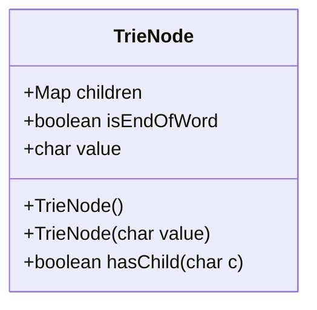
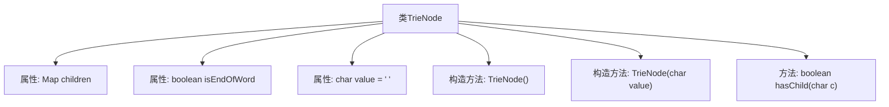

# 基础信息

|      |      |
|------|------|
| 名称 | TrieNode |
| 编码语言 | .java |
| 代码路径 | auto-suggest-java-demo/src/main/java/org/example/leansoftx/TrieNode.java |
| 包名 | org.example.leansoftx |
| 依赖项 | ['java.util.HashMap', 'java.util.Map'] |
| 概述说明 | TrieNode类含子节点映射、单词结束标志和字符值，提供构造函数和子节点检查。 |

# 说明

TrieNode类是一个用于表示字典树节点的类，包含三个主要属性：子节点映射、单词结束标志和字符值。子节点映射用于存储当前节点的子节点，单词结束标志表示当前节点是否为一个单词的结尾，字符值则存储当前节点对应的字符。该类还提供了一个构造函数用于初始化节点，以及一个方法用于检查是否存在指定的子节点。

# 类列表 Class Summary

| 名称   | 类型  | 说明 |
|-------|------|-------------|
| TrieNode | class | TrieNode类包含子节点映射、单词结束标志和字符值，提供构造函数和子节点检查方法。 |

## 类 TrieNode

|      |      |
|------|------|
| 访问范围 | public |
| 类型 | class |
| 名称 | TrieNode |
| 说明 | TrieNode类包含子节点映射、单词结束标志和字符值，提供构造函数和子节点检查方法。 |

### UML类图

### 描述
`TrieNode` 类表示字典树中的一个节点。每个节点包含一个字符 `value`，一个 `Map` 类型的 `children` 用于存储子节点，以及一个布尔值 `isEndOfWord` 用于标记当前节点是否为某个单词的结尾。类提供了两个构造函数，分别用于初始化空节点和带有字符值的节点，并提供了一个方法 `hasChild` 用于检查当前节点是否包含指定字符的子节点。

### 内部方法调用关系图

这段代码定义了一个名为`TrieNode`的类，用于表示字典树（Trie）的节点。类中包含三个属性：`children`用于存储子节点，`isEndOfWord`表示当前节点是否为一个单词的结束，`value`表示当前节点存储的字符。类中提供了两个构造方法，分别用于初始化默认节点和带有特定字符值的节点。此外，`hasChild`方法用于检查当前节点是否包含某个特定字符的子节点。该类的设计主要用于支持字典树的构建和查询操作。

### 字段列表 Field List

| 名称  | 类型  | 说明 |
|-------|-------|------|
| isEndOfWord | boolean | 该变量用于标识是否为单词的结尾。 |
| value = ' ' | char | 定义了一个公共字符变量，初始值为空格。 |
| children | Map<Character, TrieNode> | 定义字符到Trie节点的映射关系。 |

### 方法列表 Method List

| 名称  | 类型  | 说明 |
|-------|-------|------|
| hasChild | boolean | 检查字符c是否为子节点。 |

