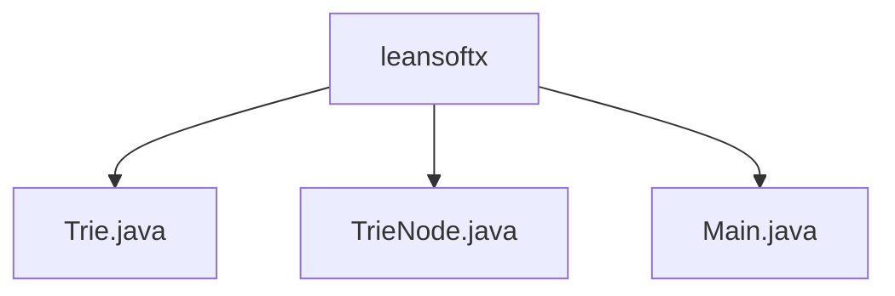

# 基础信息

|      |      |
|------|------|
| 名称 | leansoftx |
| 编码语言 | .java |
| 代码路径 | auto-suggest-java-demo/src/main/java/org/example/leansoftx |
| 包名 | auto-suggest-java-demo.src.main.java.org.example.leansoftx |
| 概述说明 | Trie树实现：插入、前缀建议、单词列表、拼写检查，基于编辑距离算法。 |

# 说明

## 概述

该代码模块实现了一个基于Trie字典树的交互式字典系统，主要提供单词存储、检索、自动补全和拼写建议功能。模块由三个核心Java类组成：

1. **TrieNode**：表示字典树的单个节点，包含字符值、子节点映射和单词结束标记
2. **Trie**：完整的字典树实现，提供插入、搜索、前缀匹配、拼写建议等核心功能
3. **Main**：交互式控制台应用，集成字典功能并提供用户界面

系统采用Levenshtein编辑距离算法实现拼写建议，支持实时前缀匹配和树形结构可视化，内置30个预定义单词作为初始字典。

## 主要业务场景

1. **单词自动补全**
   - 用户输入前缀时实时提供补全建议
   - 支持Tab键循环选择建议单词
   - 基于Trie树的高效前缀匹配

2. **拼写检查与建议**
   - 对错误拼写的单词提供修正建议
   - 使用编辑距离算法（最大距离=2）筛选候选词
   - 返回相似度最高的有效单词

3. **字典管理**
   - 初始化预置字典数据
   - 支持动态添加/删除单词
   - 可视化打印字典树结构
   - 验证单词是否存在

4. **交互式控制台操作**
   - 处理用户输入的特殊按键（退格、Tab等）
   - 空格分隔的多单词输入支持
   - 异常处理和用户反馈机制

系统特别适合需要快速前缀匹配的场景，如搜索框自动补全、命令行工具提示或拼写检查功能实现。通过Trie树结构优化了字符串存储和检索效率，编辑距离算法增强了容错处理能力。

### 包内部结构视图

该流程图展示了auto-suggest-java-demo项目中org.example.leansoftx包下的文件结构。根节点为leansoftx目录，包含三个Java源文件：Trie.java实现字典树数据结构，TrieNode.java为字典树节点类，Main.java是程序入口文件。所有文件均位于同一层级，没有嵌套的子目录结构。

# 文件列表 File List

| 名称   | 类型  | 说明 |
|-------|------|-------------|
| [Trie.java](Trie.md) | file | Trie树实现，支持插入、自动补全、拼写建议和结构打印功能。 |
| [Main.java](Main.md) | file | Java实现Trie字典树，支持插入、搜索、前缀补全和拼写建议功能。 |
| [TrieNode.java](TrieNode.md) | file | Trie树节点类，含子节点映射、结束标志和字符值。 |

