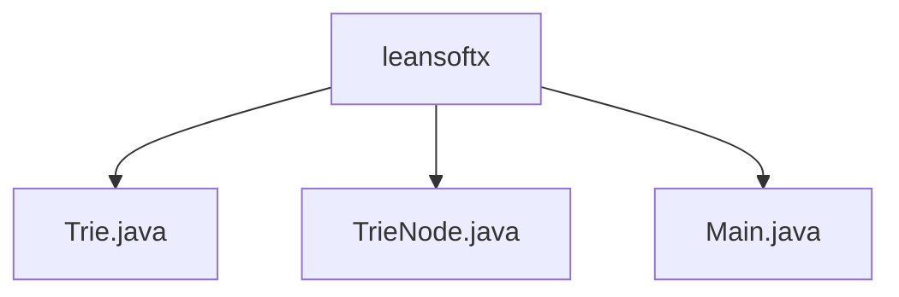

# 基础信息

|      |      |
|------|------|
| 编码语言 | .java |
| 代码路径 | auto-suggest-java-demo/src/main/java/org/example/leansoftx |
| 包名 | auto-suggest-java-demo.src.main.java.org.example.leansoftx |
| 概述说明 | Trie树实现插入、自动补全、拼写建议及结构打印功能，高效管理单词。 |

# 说明

Trie树实现包含插入、自动补全、拼写建议及结构打印功能。插入功能将单词逐字符插入树中，构建词汇结构。自动补全基于输入前缀，快速查找并返回匹配单词。拼写建议通过计算编辑距离，提供相似候选词。结构打印可视化展示Trie树层次结构，便于理解和调试。TrieNode类表示字典树节点，包含子节点映射、单词结束标志和字符值，支持查询子节点是否存在。Java程序采用Trie数据结构存储单词，具备搜索、前缀自动补全、删除和拼写建议功能，适用于快速检索和补全场景。

### 包内部结构视图

该流程图展示了`leansoftx`目录下的三个Java文件：`Trie.java`、`TrieNode.java`和`Main.java`。这些文件都位于同一个目录中，没有进一步的子目录层级。`leansoftx`作为根节点，直接连接到这三个文件，清晰地表示了它们的层级关系。

# 文件列表 File List

| 名称   | 类型  | 说明 |
|-------|------|-------------|
| [Main.java](Main.md) | file | Java程序利用Trie结构实现单词存储，支持搜索、补全、删除及拼写建议。 |
| [TrieNode.java](TrieNode.md) | file | TrieNode类含子节点映射、单词结束标志和字符值，支持查询子节点。 |
| [Trie.java](Trie.md) | file | Trie树实现插入、自动补全、拼写建议及打印功能。 |

