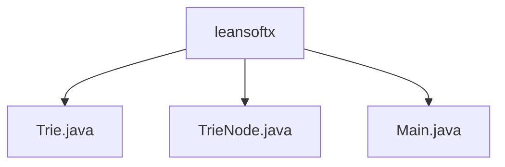

# 基础信息

|      |      |
|------|------|
| 名称 | leansoftx |
| 编码语言 | .java |
| 代码路径 | auto-suggest-java-demo/src/main/java/org/example/leansoftx |
| 包名 | auto-suggest-java-demo.src.main.java.org.example.leansoftx |
| 概述说明 | Trie类实现插入、自动建议、拼写建议和打印功能，TrieNode类表示节点，支持字符串匹配和前缀搜索。 |

# 说明

## 概述
该代码模块实现了一个基于Trie数据结构的字典系统，主要用于字符串的存储、搜索、自动补全、拼写建议等操作。模块包含三个主要类：`Trie`、`TrieNode`和`Main`。`Trie`类负责核心功能，如插入、自动建议、拼写建议和打印Trie结构；`TrieNode`类用于表示Trie的节点，支持字符映射、结束标志和子节点查询；`Main`类则整合了这些功能，提供了一个完整的字典系统，支持搜索、自动补全、删除和拼写建议等操作。

## 主要业务场景
1. **字符串插入与存储**：通过`Trie`类的插入功能，将字符串高效地存储在Trie数据结构中。
2. **字符串搜索**：利用Trie的搜索功能，快速查找特定单词是否存在于字典中。
3. **自动补全**：根据用户输入的前缀，自动提示可能的完整单词，提升输入效率。
4. **拼写建议**：针对用户输入的拼写错误，提供可能的正确单词建议，帮助用户纠正错误。
5. **字符串删除**：支持从字典中移除不再需要的单词，保持字典的更新与维护。
6. **Trie结构可视化**：通过打印功能，展示Trie的内部结构，便于调试和理解数据结构的工作机制。

该模块适用于需要高效处理字符串的场景，如搜索引擎的自动补全、拼写检查工具、字典系统等。

### 包内部结构视图

该流程图展示了`leansoftx`目录下的文件结构。`leansoftx`作为根节点，包含三个文件：`Trie.java`、`TrieNode.java`和`Main.java`。这些文件分别表示不同的Java类文件，用于实现自动建议功能的核心逻辑。

# 文件列表 File List

| 名称   | 类型  | 说明 |
|-------|------|-------------|
| [Main.java](Main.md) | file | Java程序利用Trie结构实现字典功能，支持搜索、自动补全、删除和拼写建议。 |
| [TrieNode.java](TrieNode.md) | file | TrieNode类含字符映射、结束标志、字符值，支持初始化、字符检查、子节点查询。 |
| [Trie.java](Trie.md) | file | Trie类支持插入、自动建议、拼写建议和打印结构功能。 |

