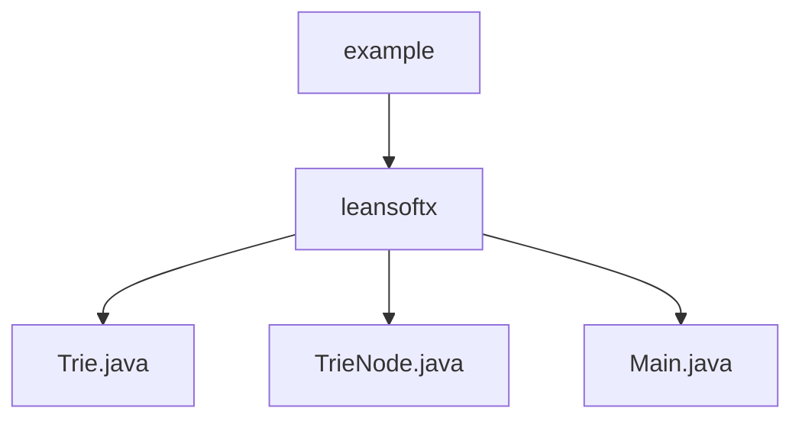

# Basic Information

|      |      |
|------|------|
| Name | example |
| Language | .java |
| Code Path | auto-suggest-java-demo/src/main/java/org/example |
| Package Name | docs.src.main.java.org.example |
| Brief Description | The code implements a trie data structure, including functionalities for insertion, search, auto-completion, spelling suggestions, and deletion. The TrieNode class stores characters, child node mappings, and an end-of-word marker. The main program supports word operations through console interaction, including prefix completion and similar word suggestions. |

# Description

## Overview  
This module implements an interactive dictionary system based on a Trie data structure, with core responsibilities including efficient word storage, prefix-based autocompletion, and spelling suggestion capabilities. The interface specification covers Trie operations such as insertion, search, deletion, traversal, and visualization. The TrieNode class uses a Map to store child node relationships, with the isEndOfWord flag marking word boundaries. The key data structure is a tree composed of TrieNodes, containing character values, child node mappings, and termination flags. External dependencies are limited to the Java standard library (e.g., Scanner and Map). For example, the Main class enables console interaction via Scanner, while the Trie class employs an edit distance algorithm to provide spelling suggestions.  

## Key Business Scenarios  
During system initialization, preset words are loaded into the Trie tree, supporting interactive queries (similar to command-line completion). User input triggers two core workflows: prefix autocompletion (Tab-key cycling through matches) and spelling suggestions (filtering based on edit distance). For instance, typing "app" may autocomplete to "apple," while entering an incorrect word returns a list of similar words. The business process integrates dynamic Trie construction (insertion/deletion) and real-time query capabilities, with all functions driven by a console menu. Typical application modes include dictionary maintenance, input method prediction, and spell-checking, with API types covering CRUD operations and suggestion generation.

### Package Internal Structure View

This flowchart illustrates the code structure of the auto-suggest-java-demo module in a Java project. The root node is the example package, which contains the leansoftx subpackage. Within the leansoftx package, there are three Java files: Trie.java implements the trie data structure, TrieNode.java is the trie node class, and Main.java serves as the program entry file. The entire structure clearly reflects the core code organization of the autocomplete functionality.

# File List

| Name   | Type  | Description |
|-------|------|-------------|
| [leansoftx](leansoftx/_module.md) | package | The code implements a trie data structure, including functionalities for insertion, search, autocompletion, spelling suggestions, and deletion. The TrieNode class stores characters, a mapping of child nodes, and an end-of-word marker. The main program supports word operations through console interaction, including prefix completion and similar word suggestions. |

