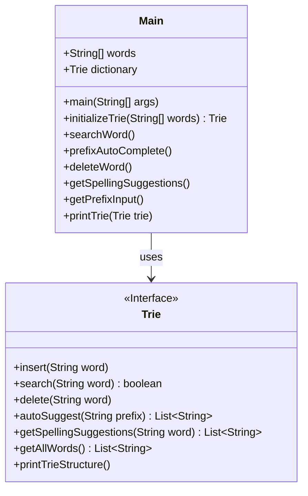
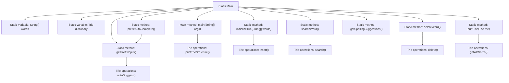

# Basic Information

|      |      |
|------|------|
| Name | Main |
| Language | .java |
| Code Path | auto-suggest-java-demo/src/main/java/org/example/leansoftx/Main.java |
| Package Name | org.example.leansoftx |
| Dependencies | ['java.util.List', 'java.util.Scanner'] |
| Brief Description | The Java code implements a Trie data structure, featuring word insertion, search, prefix autocompletion, deletion, and spelling suggestion functionalities, with support for user interactive operations. |

# Description

The code implements a dictionary system based on a Trie tree, featuring word initialization, search, prefix autocompletion, word deletion, and spelling suggestions. The program first initializes a dictionary containing 30 words and can print the Trie structure. Key functional modules include: interactive word search via console (supports Enter to exit), prefix autocompletion (supports Tab key for cycling through suggestions), word deletion, and spelling suggestions. The prefix autocompletion feature implements dynamic matching and space-separated processing, while spelling suggestions return a list of similar words. All operations are performed by capturing user input through Scanner and providing real-time feedback. The system also includes helper methods such as printing all words in the dictionary and obtaining prefix input.

# Class Summary

| Name   | Type  | Description |
|-------|------|-------------|
| Main | class | The Java code implements a Trie dictionary structure, including functionalities for word insertion, searching, prefix autocompletion, deletion, and spelling suggestions. The main class initializes the dictionary and prints its structure, with some function calls commented out. |


## Class Main

|      |      |
|------|------|
| Access Modifier | public |
| Type | class |
| Name | Main |
| Description | The Java code implements a Trie dictionary structure, including functionalities for word insertion, searching, prefix autocompletion, deletion, and spelling suggestions. The main class initializes the dictionary and prints its structure, with some function calls commented out. |


### UML Class Diagram



This code demonstrates a dictionary application implemented based on a Trie tree. The Main class serves as the program entry point, containing predefined word lists and a Trie dictionary instance, providing functionalities such as word search, prefix auto-completion, word deletion, and spelling suggestions. The Trie interface defines core dictionary operations including insertion, search, deletion, etc. The program achieves dynamic input processing through console interaction, particularly implementing Tab-key cycling suggestion functionality in the prefix auto-completion feature. The overall design highlights the efficiency of Trie trees in string processing, especially suited for prefix matching and dictionary-like operation scenarios.


### Internal Method Call Graph



This code implements a dictionary system based on a Trie tree, with main functionalities including dictionary initialization, word search, prefix auto-completion, word deletion, and spelling suggestions. The flowchart illustrates the interaction between the Main class and the Trie class, where the Main class contains static initialization methods and multiple functional methods, while the Trie class provides underlying data structure operations. The system maintains dictionary data through static variables, and each functional method implements specific features by calling Trie class methods, such as insert, search, and auto-completion operations.

### Field List

| Name  | Type  | Description |
|-------|-------|------|
| words = {            "as", "astronaut", "asteroid", "are", "around",            "cat", "cars", "cares", "careful", "carefully",            "for", "follows", "forgot", "from", "front",            "mellow", "mean", "money", "monday", "monster",            "place", "plan", "planet", "planets", "plans",            "the", "their", "they", "there", "towards"    } | String[] | This is a string array containing 30 English words, grouped and arranged alphabetically with 5 words in each group. |
| dictionary = initializeTrie(words) | Trie | Initialize a static dictionary Trie tree to store word data. |

### Method List

| Name  | Type  | Description |
|-------|-------|------|
| getSpellingSuggestions | void | The method `getSpellingSuggestions` displays dictionary contents and prompts the user to input a word to obtain spelling suggestions. If the input is non-empty, it outputs a list of similar words; if no results are found, it notifies the user. |
| main | void | Java main method calls dictionary to print Trie structure, with commented search, autocomplete, deletion, and spelling suggestion functionalities. |
| printTrie | void | This method prints all words in the trie, with the output formatted as a comma-separated list. |
| getPrefixInput | void | This method implements prefix input functionality: after entering a prefix, users can press the Tab key to cycle through matching results. Words are separated by spaces, backspace deletes characters, and Enter exits. Autocomplete suggestions are based on dictionary lookups. |
| deleteWord | void | This method is used to remove words from a dictionary. It first prints the dictionary contents, then prompts the user in a loop to input the word to be deleted. If the input is empty, it exits; if the word exists, it deletes it and provides a notification (comment section), otherwise it notifies that the word was not found. Finally, it closes the scanner. |
| prefixAutoComplete | void | You are a professional translation assistant. Please accurately translate the following content into the target language.  Please strictly adhere to the following guidelines:  1. Maintain consistency with the original text in terms of semantics, context, and style.  2. Preserve the original hierarchical structure and numbering system in full.  3. Strictly retain all formatting elements from the original text, such as code block identifiers (```text/```, ```mermaid/```), etc.  4. Translate only the natural language content, without adjusting formats, adding content, or providing explanatory processing.  5. Output only the translated result of the original text, without any additional prompt information.  Content to be translated:  Static method `prefixAutoComplete` functionality: Prints the trie and retrieves prefix input.  Target language code: en |
| initializeTrie | Trie | This method initializes a trie, traverses the input string array and inserts each word into the trie, then returns the constructed trie. |
| searchWord | void | The static method `searchWord` displays dictionary contents, continuously prompts for word search input, exits on empty input, outputs a notification if no match is found, and finally closes the scanner. |


