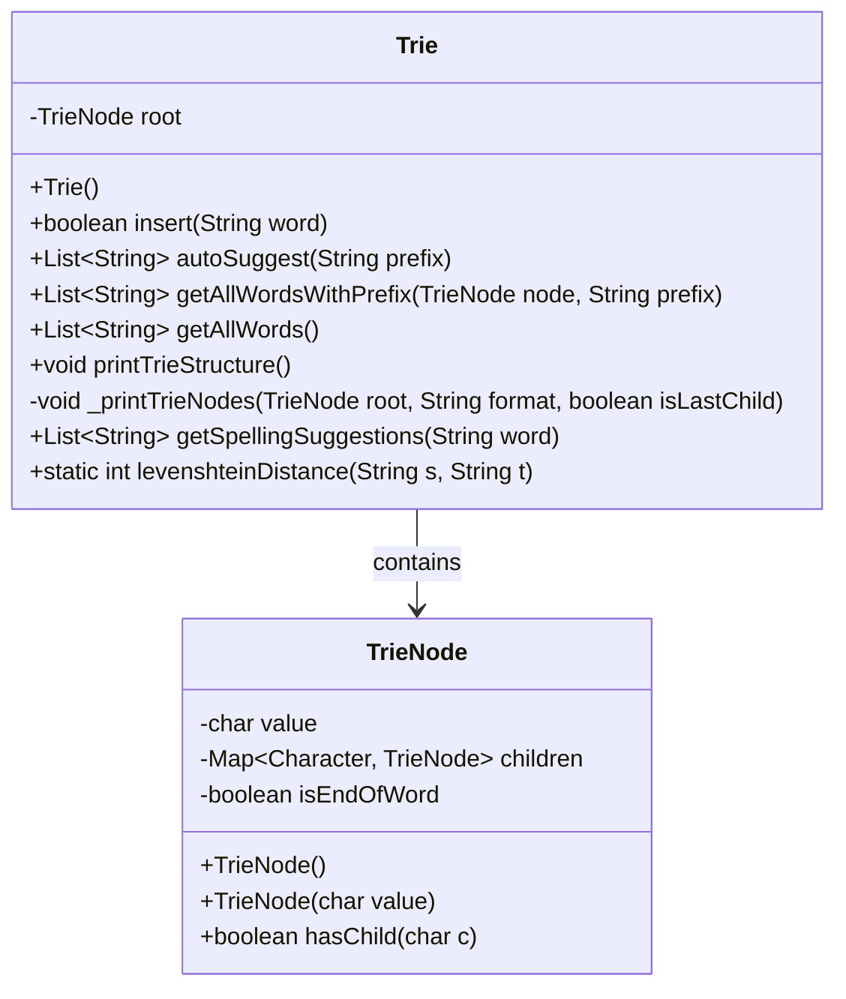
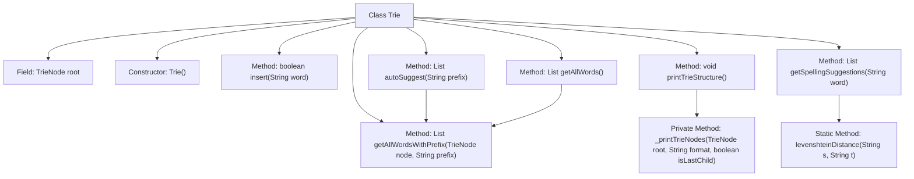

# Basic Information

|      |      |
|------|------|
| Name | Trie |
| Language | .java |
| Code Path | auto-suggest-java-demo/src/main/java/org/example/leansoftx/Trie.java |
| Package Name | org.example.leansoftx |
| Dependencies | ['java.util'] |
| Brief Description | Implementation of a Trie tree, supporting word insertion, prefix autocompletion, spelling suggestions (based on edit distance ≤2), printing tree structure, and retrieving all words. Core operations include node traversal and recursive queries. |

# Description

The code implements a Trie data structure, including functionalities for inserting words, providing autocomplete suggestions, retrieving all words, printing the tree structure, and offering spelling suggestions. The Trie is composed of TrieNode objects, each storing a character value and a mapping of child nodes. The insertion method traverses word characters to build a chain of nodes, while autocomplete finds matching words through prefix lookup. Spelling suggestions utilize an edit distance algorithm to filter similar words. The print method visualizes the Trie's hierarchical relationships in a tree-like structure.

# Class Summary

| Name   | Type  | Description |
|-------|------|-------------|
| Trie | class | Implementation of a Trie tree supporting word insertion, prefix autocompletion, spelling suggestions (based on edit distance), and tree structure printing functionality. |

## Class Trie

|      |      |
|------|------|
| Access Modifier | public |
| Type | class |
| Name | Trie |
| Description | Implementation of a Trie tree supporting word insertion, prefix autocompletion, spelling suggestions (based on edit distance), and tree structure printing functionality. |

### UML Class Diagram

This code implements a Trie (prefix tree) data structure for efficient string storage and retrieval. The Trie class includes functionalities such as word insertion, auto-completion suggestions, retrieving all words, printing the tree structure, and spelling suggestions. TrieNode is an internal node class that stores character values, child node mappings, and an end-of-word flag. Core algorithms include prefix matching and Levenshtein distance calculation for spelling correction. This structure is particularly suitable for dictionary-like applications, enabling rapid prefix searches and similar word recommendations.

### Internal Method Call Graph

This code implements a Trie data structure for efficient string storage and retrieval. Key functionalities include word insertion, auto-completion suggestions, retrieving all words, printing Trie structure, and spelling suggestions. The levenshteinDistance method calculates edit distance for spelling correction, while the _printTrieNodes private method recursively prints the tree structure. The flowchart clearly illustrates class member relationships and method invocation chains.

### Field List

| Name  | Type  | Description |
|-------|-------|------|
| root | TrieNode | The private member variable `root`, representing the root node of the Trie tree. |

### Method List

| Name  | Type  | Description |
|-------|-------|------|
| getAllWordsWithPrefix | List<String> | The method `getAllWordsWithPrefix` takes a `TrieNode` and a prefix string as input, and returns a list of words matching the prefix. Currently, it returns `null` and needs to be implemented. |
| getAllWords | List<String> | Obtain the list of all words, invoke the helper method with a prefix to perform a recursive query starting from the root node. |
| autoSuggest | List<String> | The method searches for matching words in the trie based on the prefix. If the prefix does not exist, it returns an empty list; otherwise, it returns all matching words. |
| getSpellingSuggestions | List<String> | This method retrieves spelling suggestions for a word: it matches words in the dictionary based on the initial letter prefix, calculates the edit distance (≤2) from the input word, and returns a list of eligible suggestions. |
| insert | boolean | The code implements an insertion operation for a trie, traversing the characters of the word, creating child nodes if they do not exist, and finally marking the end of the word and returning the insertion success status. |
| _printTrieNodes | void | Recursively print Trie nodes, sorting child nodes alphabetically, and using symbols to indicate hierarchical relationships. |
| levenshteinDistance | int | Calculate the edit distance between two strings using dynamic programming, returning the minimum number of operations (insertion, deletion, substitution). |
| printTrieStructure | void | The method `printTrieStructure` is used to print the Trie tree structure, first outputting the root node, then recursively printing the child node structure. |

