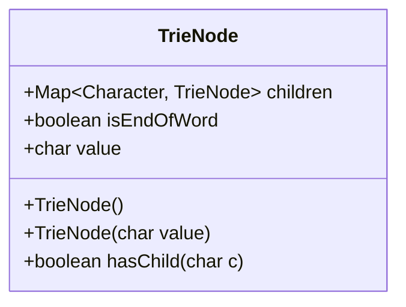
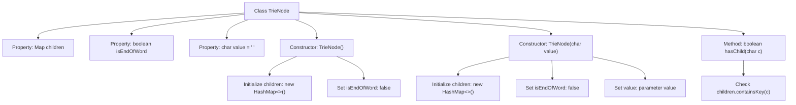

# Basic Information

|      |      |
|------|------|
| Name | TrieNode |
| Language | .java |
| Code Path | auto-suggest-java-demo/src/main/java/org/example/leansoftx/TrieNode.java |
| Package Name | org.example.leansoftx |
| Dependencies | ['java.util.HashMap', 'java.util.Map'] |
| Brief Description | The TrieNode class represents a dictionary tree node, containing a child node mapping, a word end flag, and a character value. It provides a constructor method and a method to check for the existence of child nodes. |

# Description

The content describes a TrieNode class used to implement the trie data structure. The class includes three member variables: `children` is a Map that maps characters to child nodes, `isEndOfWord` marks whether it is the end of a word, and `value` stores the character value of the current node. Two constructors are provided: a no-argument constructor initializes an empty child node map and default values, while a parameterized constructor allows setting the character value. It also includes a method `hasChild` to check whether a child node exists for a specified character. The entire class structure supports the basic operational requirements of a trie.

# Class Summary

| Name   | Type  | Description |
|-------|------|-------------|
| TrieNode | class | The TrieNode class represents a trie node, containing a child node map, character value, and word end flag, and provides methods to check for the existence of child nodes. |

## Class TrieNode

|      |      |
|------|------|
| Access Modifier | public |
| Type | class |
| Name | TrieNode |
| Description | The TrieNode class represents a trie node, containing a child node map, character value, and word end flag, and provides methods to check for the existence of child nodes. |

### UML Class Diagram

This code defines a TrieNode class used to implement the Trie data structure. The class contains three main member variables: children is a map that stores the correspondence between characters and child nodes; isEndOfWord marks whether the current node is the end of a word; value stores the character value represented by the current node. The class provides two constructors (default and one with a character parameter) and a hasChild method to check if a child node exists for a specified character. This class serves as the foundational node structure for implementing a Trie, enabling efficient character retrieval and word storage functionality through the children map.

### Internal Method Call Graph

This flowchart illustrates the structure of the TrieNode class and its key method invocation relationships. The class contains 3 properties and 2 constructors, where the no-arg constructor initializes an empty HashMap with default values, while the parameterized constructor additionally sets the character value. The hasChild method determines child node existence by checking the children map, suitable for implementing the Trie data structure.

### Field List

| Name  | Type  | Description |
|-------|-------|------|
| children | Map<Character, TrieNode> | The class defines a public Map-type variable named children, with Character as the key and TrieNode as the value. |
| isEndOfWord | boolean | The variable isEndOfWord indicates whether it is the end of a word, of boolean type. |
| value = ' ' | char | Declare a public character variable value with an initial value of space. |

### Method List

| Name  | Type  | Description |
|-------|-------|------|
| hasChild | boolean | Check if the character c is a child node key value, return true if it exists, otherwise false. |

