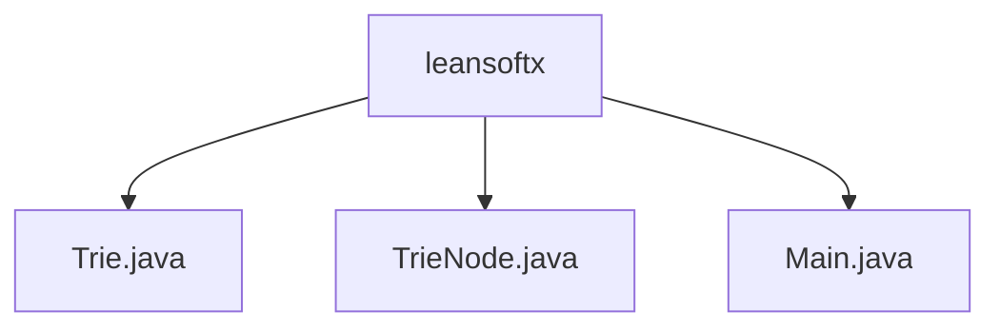

# Basic Information

|      |      |
|------|------|
| Name | leansoftx |
| Language | .java |
| Code Path | auto-suggest-java-demo/src/main/java/org/example/leansoftx |
| Package Name | docs.src.main.java.org.example.leansoftx |
| Brief Description | The code implements a trie data structure, including functionalities for insertion, search, autocompletion, spelling suggestions, and deletion. The TrieNode class stores characters, a mapping of child nodes, and an end-of-word marker. The main program supports word operations through console interaction, including prefix completion and similar word suggestions. |

# Description

## Overview  
This module implements an interactive dictionary system based on a Trie data structure, with core responsibilities including efficient word storage, prefix-based autocompletion, and spelling suggestion functionalities. The interface specification covers Trie operations such as insertion, search, deletion, traversal, and visualization. The TrieNode class uses a Map to store child node relationships, with the isEndOfWord flag marking word boundaries. The key data structure is a tree composed of TrieNodes, containing character values, child node mappings, and termination flags. External dependencies are limited to the Java standard library (e.g., Scanner and Map). For example, the Main class implements console interaction via Scanner, while the Trie class employs an edit distance algorithm to provide spelling suggestions.  

## Key Business Scenarios  
During system initialization, preset words are loaded into the Trie tree, supporting interactive queries (similar to command-line completion). User input triggers two core workflows: prefix autocompletion (cycling through matches via the Tab key) and spelling suggestions (filtering based on edit distance). For instance, typing "app" may autocomplete to "apple," while entering an incorrect word returns a list of similar words. The business process integrates dynamic Trie tree construction (insertion/deletion) and real-time query capabilities, with all functionalities driven by a console menu. Typical application modes include dictionary maintenance, input method prediction, and spell-checking, with API types covering CRUD operations and suggestion generation.

### Package Internal Structure View

This flowchart illustrates the file structure within the `leansoftx` package of the `auto-suggest-java-demo` project. The root node is the `leansoftx` package, which contains three Java files: `Trie.java` implements the trie data structure, `TrieNode.java` is the trie node class, and `Main.java` serves as the program entry file. This structure represents a typical small-scale Java project layout, where core classes and the main program file are placed directly under the same package level.

# File List

| Name   | Type  | Description |
|-------|------|-------------|
| [Main.java](Main.md) | file | The Java code implements a Trie data structure, which includes functionalities for word insertion, searching, prefix-based autocompletion, deletion, and spelling suggestions, supporting user interactive operations. |
| [TrieNode.java](TrieNode.md) | file | The TrieNode class represents a trie node, containing a child node map, a word end flag, and a character value, providing a constructor method and a method to check for the existence of child nodes. |
| [Trie.java](Trie.md) | file | Implementation of a Trie tree, supporting word insertion, prefix autocompletion, spelling suggestions (based on edit distance ≤2), tree structure printing, and retrieval of all words. Core operations include node traversal and recursive queries. |

