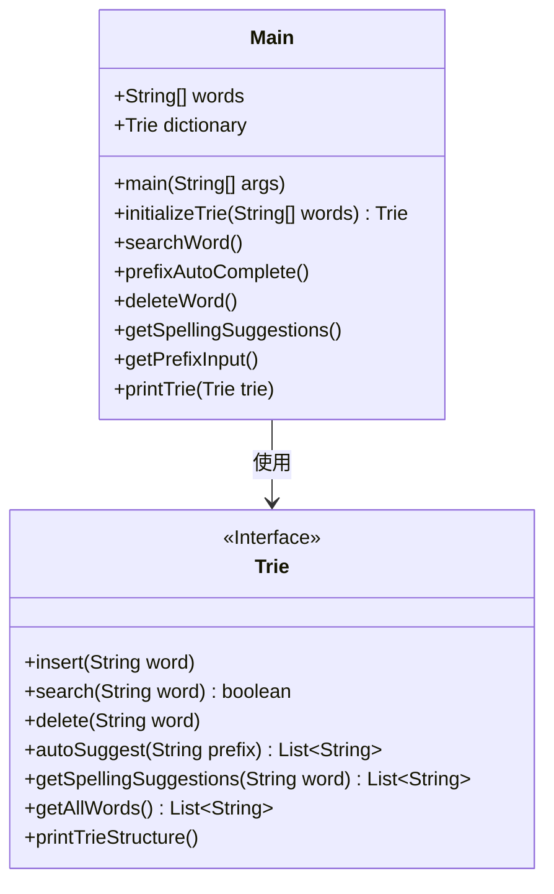
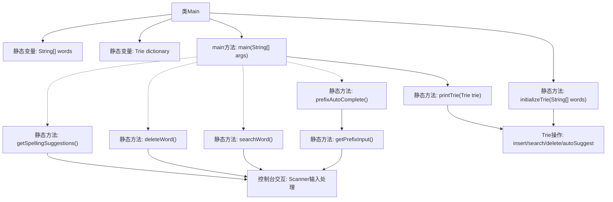

# 基础信息

|      |      |
|------|------|
| 名称 | Main |
| 编码语言 | .java |
| 代码路径 | auto-suggest-java-demo/src/main/java/org/example/leansoftx/Main.java |
| 包名 | org.example.leansoftx |
| 依赖项 | ['java.util.List', 'java.util.Scanner'] |
| 概述说明 | Java代码实现字典树功能，包含搜索、自动补全和拼写建议。 |

# 说明

该代码实现了一个基于Trie结构的字典系统，包含30个预定义单词。主要功能包括初始化字典、打印字典结构、搜索单词、前缀自动补全、删除单词和拼写建议。系统通过控制台交互，支持输入处理、退格键删除、Tab键补全和空格分隔单词。未启用的搜索和删除功能留有注释接口，自动补全功能会缓存建议列表并循环显示匹配结果。异常处理捕获并打印运行时错误，所有交互操作均通过Scanner类实现。

# 类列表 Class Summary

| 名称   | 类型  | 说明 |
|-------|------|-------------|
| Main | class | Java实现Trie字典树，支持插入、搜索、前缀补全和拼写建议功能。 |

## 类 Main

|      |      |
|------|------|
| 访问范围 | public |
| 类型 | class |
| 名称 | Main |
| 说明 | Java实现Trie字典树，支持插入、搜索、前缀补全和拼写建议功能。 |

### UML类图

类图描述：
该代码实现了一个基于Trie树的字典系统，Main类作为入口点包含字典初始化、单词搜索、前缀自动补全、单词删除和拼写建议等功能。Trie接口定义了字典的核心操作，包括插入、搜索、删除、自动建议和拼写建议等方法。Main类通过组合方式使用Trie接口，实现了完整的字典应用功能，支持交互式操作和字典内容展示。系统设计注重功能模块化，便于扩展和维护。

### 内部方法调用关系图

流程图描述：该流程图展示了Main类的完整结构，包含静态字典初始化、Trie树操作和用户交互功能。核心流程从main方法开始，可选择执行打印字典结构、单词搜索、前缀自动补全、单词删除或拼写建议等功能。其中getPrefixInput()方法实现了复杂的控制台交互逻辑，处理退格、空格和Tab补全等特殊输入。所有功能最终都通过Trie类的底层操作实现，包括插入、搜索、删除和自动建议等方法。

### 字段列表 Field List

| 名称  | 类型  | 说明 |
|-------|-------|------|
| dictionary = initializeTrie(words) | Trie | 静态字典树初始化 |
| words = {            "as", "astronaut", "asteroid", "are", "around",            "cat", "cars", "cares", "careful", "carefully",            "for", "follows", "forgot", "from", "front",            "mellow", "mean", "money", "monday", "monster",            "place", "plan", "planet", "planets", "plans",            "the", "their", "they", "there", "towards"    } | String[] | 包含常用英文单词的字符串数组，按字母分组，如a、c、f、m、p、t开头的词汇。 |

### 方法列表 Method List

| 名称  | 类型  | 说明 |
|-------|-------|------|
| searchWord | void | 静态方法searchWord展示字典内容，循环提示输入单词并检查是否存在，空输入退出。 |
| getPrefixInput | void | 输入前缀按Tab搜索，空格分隔，回车退出，退格删除，自动补全建议。 |
| initializeTrie | Trie | 静态方法初始化Trie并插入单词数组。 |
| main | void | Java主函数调用字典打印Trie结构，其他功能被注释。 |
| getSpellingSuggestions | void | 静态方法展示字典拼写建议，输入单词后输出相似词或提示无建议。 |
| deleteWord | void | 静态方法删除字典单词，输入空退出，未找到提示。 |
| prefixAutoComplete | void | 静态方法实现前缀自动补全功能，打印字典树并获取前缀输入。 |
| printTrie | void | 打印字典树中的所有单词，用逗号分隔。 |

