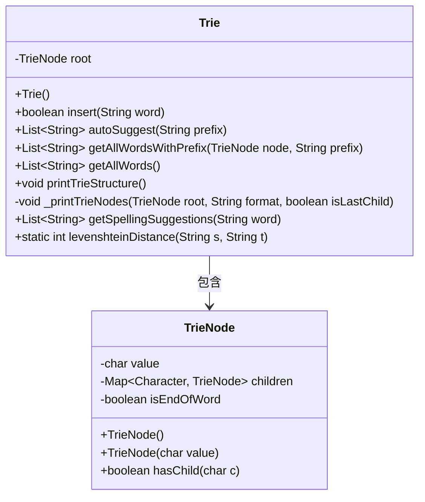
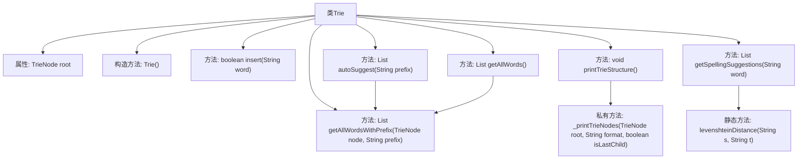

# 基础信息

|      |      |
|------|------|
| 名称 | Trie |
| 编码语言 | .java |
| 代码路径 | auto-suggest-java-demo/src/main/java/org/example/leansoftx/Trie.java |
| 包名 | org.example.leansoftx |
| 依赖项 | ['java.util'] |
| 概述说明 | Trie树实现，支持插入、自动补全、拼写建议和结构打印功能。 |

# 说明

该内容描述了一个Trie（前缀树）数据结构的实现。主要功能包括插入单词、自动补全建议、获取所有单词、打印树结构以及拼写建议。插入单词时会检查是否已存在，自动补全基于前缀匹配，拼写建议使用编辑距离算法找出相似单词。树结构打印采用可视化格式显示节点层次关系。

# 类列表 Class Summary

| 名称   | 类型  | 说明 |
|-------|------|-------------|
| Trie | class | Trie树实现，支持插入、自动补全、拼写建议和打印结构。 |

## 类 Trie

|      |      |
|------|------|
| 访问范围 | public |
| 类型 | class |
| 名称 | Trie |
| 说明 | Trie树实现，支持插入、自动补全、拼写建议和打印结构。 |

### UML类图

这段代码实现了一个Trie（前缀树）数据结构，用于高效存储和检索字符串。Trie类包含插入单词、自动补全建议、获取所有单词、打印树结构以及拼写建议等功能。TrieNode类表示树的节点，包含字符值、子节点映射和单词结束标志。levenshteinDistance方法计算两个字符串的编辑距离，用于拼写建议功能。该实现特别适合字典应用和单词自动补全场景。

### 内部方法调用关系图

这段代码实现了一个Trie（前缀树）数据结构，用于高效存储和检索字符串。主要功能包括插入单词、自动补全建议、获取所有单词、打印Trie结构以及拼写建议。流程图展示了Trie类的结构，包括构造方法、公有方法和私有方法之间的调用关系。其中核心方法是insert()用于构建Trie树，autoSuggest()提供前缀匹配，getSpellingSuggestions()利用编辑距离算法提供拼写纠正建议。

### 字段列表 Field List

| 名称  | 类型  | 说明 |
|-------|-------|------|
| root | TrieNode | 私有根节点变量。 |

### 方法列表 Method List

| 名称  | 类型  | 说明 |
|-------|-------|------|
| printTrieStructure | void | 打印Trie树结构，显示根节点及子节点。 |
| getAllWords | List<String> | 获取所有单词列表，从根节点开始递归查找。 |
| autoSuggest | List<String> | 方法根据前缀返回匹配的单词列表，若无匹配则返回空列表。 |
| getSpellingSuggestions | List<String> | 获取拼写建议：基于前缀和编辑距离筛选相似词。 |
| insert | boolean | Trie树插入单词方法，存在返回false，否则插入并返回true。 |
| _printTrieNodes | void | 递归打印Trie树节点，按字母排序显示子节点，用符号表示层级关系。 |
| getAllWordsWithPrefix | List<String> | 方法定义：获取前缀匹配的所有单词，返回列表，当前返回空。 |
| levenshteinDistance | int | 计算两个字符串的编辑距离，通过动态规划实现。 |

