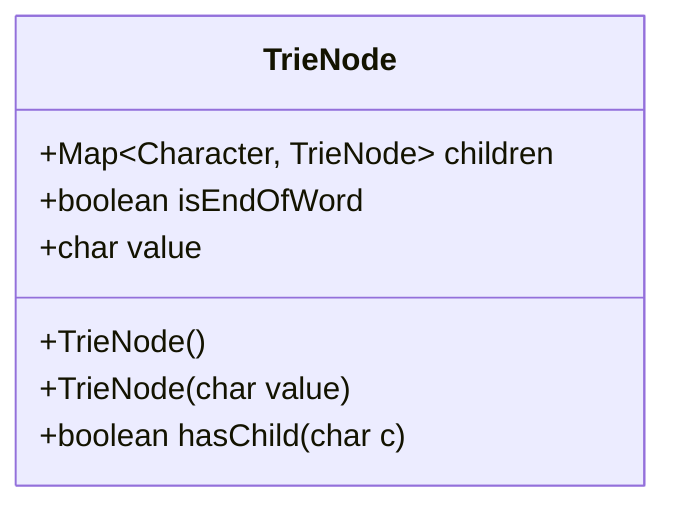
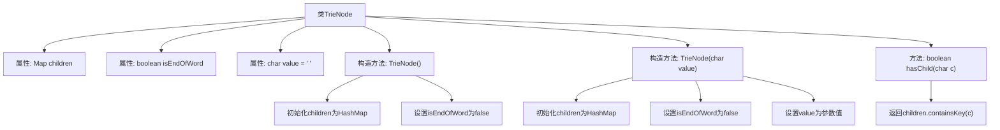

# 基础信息

|      |      |
|------|------|
| 名称 | TrieNode |
| 编码语言 | .java |
| 代码路径 | auto-suggest-java-demo/src/main/java/org/example/leansoftx/TrieNode.java |
| 包名 | org.example.leansoftx |
| 依赖项 | ['java.util.HashMap', 'java.util.Map'] |
| 概述说明 | Trie树节点类，含子节点映射、结束标志和字符值。 |

# 说明

该内容定义了一个名为TrieNode的类，用于实现字典树节点结构。类中包含三个成员变量：children是一个字符到TrieNode的映射，用于存储子节点；isEndOfWord是布尔值，标记当前节点是否为单词结尾；value存储节点代表的字符值。类提供了两个构造函数：无参构造函数初始化空子节点映射和非单词结尾状态；带参构造函数额外设置字符值。还包含一个hasChild方法，用于检查是否存在指定字符的子节点。整个结构支持字典树的基本操作需求。

# 类列表 Class Summary

| 名称   | 类型  | 说明 |
|-------|------|-------------|
| TrieNode | class | Trie树节点类，含子节点映射、结束标志和字符值。 |

## 类 TrieNode

|      |      |
|------|------|
| 访问范围 | public |
| 类型 | class |
| 名称 | TrieNode |
| 说明 | Trie树节点类，含子节点映射、结束标志和字符值。 |

### UML类图

这段代码定义了一个TrieNode类，用于实现字典树(Trie)数据结构。该类包含三个主要成员：一个Map类型的children用于存储子节点，一个boolean类型的isEndOfWord标记当前节点是否为一个单词的结尾，以及一个char类型的value存储当前节点的字符值。类提供了两个构造函数（默认构造函数和带字符参数的构造函数）以及一个hasChild方法用于检查是否存在指定字符的子节点。这个类是实现字典树的基础结构，常用于高效存储和检索字符串集合。

### 内部方法调用关系图

这段代码定义了一个TrieNode类，用于实现字典树（Trie）数据结构。类包含三个属性：children用于存储子节点映射关系，isEndOfWord标记单词结束位置，value存储当前节点字符。提供两个构造方法：默认构造方法初始化空子节点映射，带参构造方法额外设置节点字符值。hasChild方法用于检查是否存在指定字符的子节点。流程图清晰展示了类结构、构造方法逻辑和关键方法调用关系。

### 字段列表 Field List

| 名称  | 类型  | 说明 |
|-------|-------|------|
| children | Map<Character, TrieNode> | 公开映射字符到Trie节点的子节点集合。 |
| isEndOfWord | boolean | 标记单词结束的布尔变量。 |
| value = ' ' | char | 声明字符变量value，初始值为空格。 |

### 方法列表 Method List

| 名称  | 类型  | 说明 |
|-------|-------|------|
| hasChild | boolean | 检查是否存在字符c对应的子节点。 |

