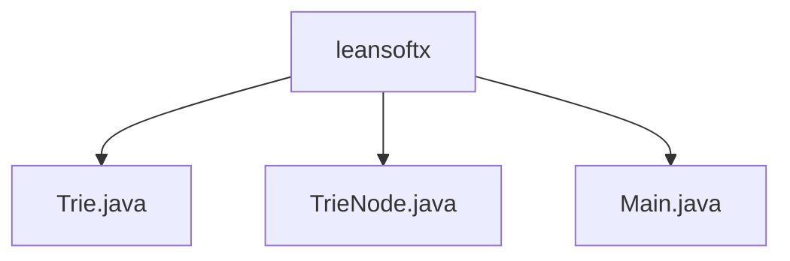

# 基础信息

|      |      |
|------|------|
| 名称 | leansoftx |
| 编码语言 | .java |
| 代码路径 | auto-suggest-java-demo/src/main/java/org/example/leansoftx |
| 包名 | auto-suggest-java-demo.docs.src.main.java.org.example.leansoftx |
| 概述说明 | Trie树实现：插入、补全、拼建建议、打印结构。节点类含子节点映射和字符标记。系统预置字典，支持交互操作。 |

# 说明

# Trie字典树模块总结

## 概述
该模块实现了一个基于Trie(前缀树)数据结构的字典系统，主要提供单词存储、查询和自动补全功能。模块由三个核心类组成：
1. `Trie` - 实现前缀树的主要操作逻辑
2. `TrieNode` - 定义字典树的节点结构
3. `Main` - 提供交互式控制台界面和系统入口

系统预加载了30个单词，支持动态插入新词、前缀匹配自动补全、拼写建议等实用功能，并通过可视化方式展示树形结构。

## 主要业务场景

1. **单词存储与检索**
   - 支持高效插入新单词并自动去重
   - 提供精确单词搜索功能
   - 可获取字典中存储的所有单词列表

2. **智能输入辅助**
   - 前缀自动补全：输入部分字符后按Tab键显示匹配建议
   - 拼写建议：基于编辑距离算法推荐相似单词
   - 支持退格键删除和空格分隔多词输入

3. **字典维护**
   - 可视化打印树形结构，便于调试和理解
   - 提供单词删除功能(接口已预留)
   - 支持运行时动态扩展词汇量

4. **交互式学习工具**
   - 通过控制台实现用户友好交互
   - 异常处理机制保障系统稳定性
   - 可作为字典数据结构的学习演示系统

### 包内部结构视图

该流程图展示了auto-suggest-java-demo项目中leansoftx包下的文件结构关系。根节点为leansoftx文件夹，包含三个Java源文件：Trie.java实现字典树数据结构，TrieNode.java为字典树节点类，Main.java是程序入口文件。这种扁平化结构表明这是一个小型Java项目，所有核心类都直接放在包目录下。

# 文件列表 File List

| 名称   | 类型  | 说明 |
|-------|------|-------------|
| [Main.java](Main.md) | file | Java代码实现字典树功能，包含搜索、自动补全和拼写建议。 |
| [TrieNode.java](TrieNode.md) | file | Trie树节点类，含子节点映射、结束标志和字符值。 |
| [Trie.java](Trie.md) | file | Trie树实现，支持插入、自动补全、拼写建议和结构打印功能。 |

