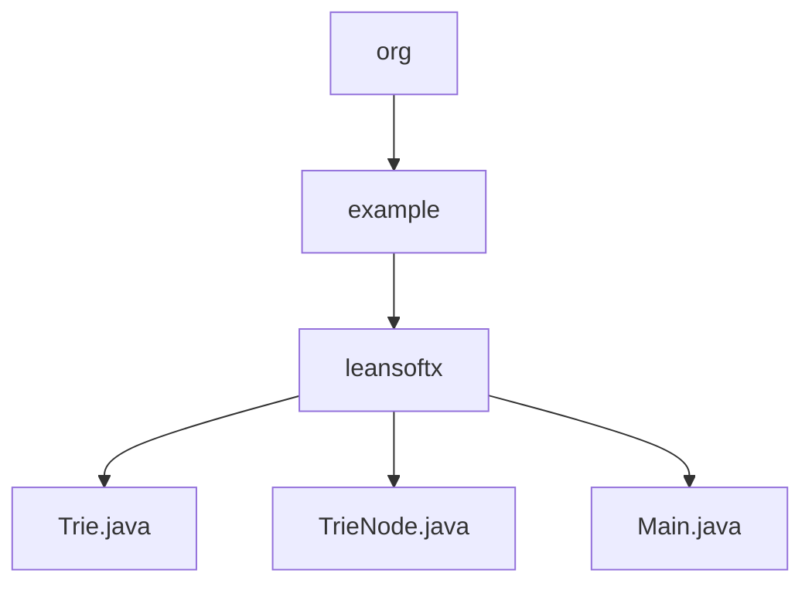

# 基础信息

|      |      |
|------|------|
| 名称 | org |
| 编码语言 | .java |
| 代码路径 | auto-suggest-java-demo/src/main/java/org |
| 包名 | docs.src.main.java.org |
| 概述说明 | 该代码实现字典树数据结构，包含插入、搜索、自动补全、拼写建议和删除功能。TrieNode类存储字符、子节点映射和单词结束标记。主程序通过控制台交互支持单词操作，包括前缀补全和相似词建议。 |

# 说明

## 概述  
该模块实现了一个基于字典树（Trie）的交互式字典系统，核心职责包括高效存储单词、支持前缀自动补全和拼写建议功能。接口规范涵盖Trie树的插入、搜索、删除、遍历及可视化操作，其中TrieNode类通过Map存储子节点关系，isEndOfWord标记单词边界。关键数据结构为TrieNode构成的树形结构，包含字符值、子节点映射和终止标志。外部依赖仅Java标准库（如Scanner和Map）。例如，Main类通过Scanner实现控制台交互，Trie类使用编辑距离算法提供拼写建议。

## 主要业务场景  
系统初始化时加载预设单词到Trie树，支持交互式查询（类似命令行补全）。用户输入触发两种核心流程：前缀补全（Tab键循环匹配）和拼写建议（基于编辑距离筛选）。例如输入"app"可能补全为"apple"，输入错误单词返回相似词列表。业务流程整合了Trie树的动态构建（插入/删除）和实时查询能力，所有功能通过控制台菜单驱动。典型应用模式包括字典维护、输入法联想和拼写检查，API类型涵盖CRUD操作与建议生成。

### 包内部结构视图

该流程图展示了Java项目中从org包到具体实现类的完整层级关系。根节点org包含子节点example，后者进一步包含leansoftx包。在leansoftx包下有三个Java类文件：Trie.java实现字典树数据结构，TrieNode.java为字典树节点类，Main.java包含程序入口。这种层级结构体现了标准Java项目的包组织方式，符合从通用到具体的命名规范。

# 文件列表

| 名称   | 类型  | 说明 |
|-------|------|-------------|
| [example](example/_module.md) | package | 该代码实现字典树数据结构，包含插入、搜索、自动补全、拼写建议和删除功能。TrieNode类存储字符、子节点映射和单词结束标记。主程序通过控制台交互支持单词操作，包括前缀补全和相似词建议。 |

