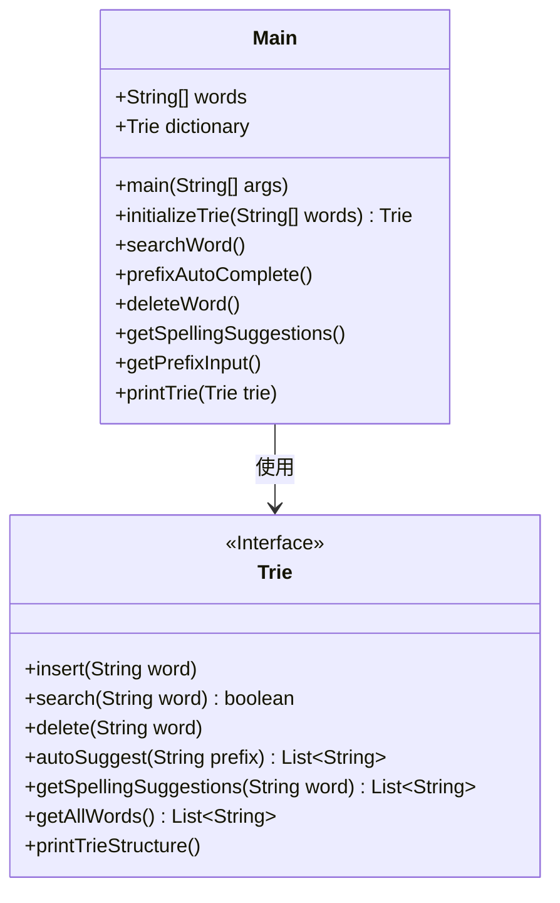
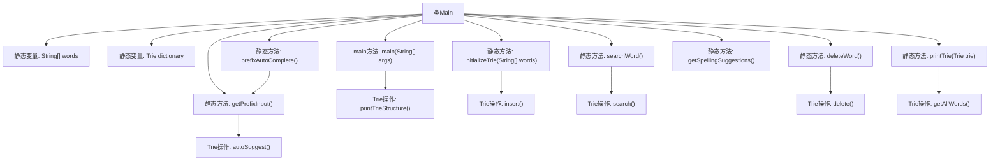

# 基础信息

|      |      |
|------|------|
| 名称 | Main |
| 编码语言 | .java |
| 代码路径 | auto-suggest-java-demo/src/main/java/org/example/leansoftx/Main.java |
| 包名 | org.example.leansoftx |
| 依赖项 | ['java.util.List', 'java.util.Scanner'] |
| 概述说明 | Java代码实现了一个Trie字典树，包含单词插入、搜索、前缀自动补全、删除和拼写建议功能，支持用户交互操作。 |

# 说明

该代码实现了一个基于Trie树的字典系统，包含单词初始化、搜索、前缀自动补全、删除单词和拼写建议功能。程序首先初始化包含30个单词的字典，可打印Trie结构。主要功能模块包括：通过控制台交互搜索单词（支持回车退出）、前缀自动补全（支持Tab键循环建议）、删除单词和获取拼写建议。其中前缀补全功能实现了动态匹配和空格分隔处理，拼写建议会返回相似单词列表。所有操作都通过Scanner获取用户输入，并实时反馈结果。系统还包含辅助方法如打印字典所有单词和获取前缀输入。

# 类列表 Class Summary

| 名称   | 类型  | 说明 |
|-------|------|-------------|
| Main | class | Java代码实现了一个Trie字典结构，包含单词插入、搜索、前缀自动补全、删除和拼写建议功能。主类初始化字典并打印结构，注释了部分功能调用。 |

## 类 Main

|      |      |
|------|------|
| 访问范围 | public |
| 类型 | class |
| 名称 | Main |
| 说明 | Java代码实现了一个Trie字典结构，包含单词插入、搜索、前缀自动补全、删除和拼写建议功能。主类初始化字典并打印结构，注释了部分功能调用。 |

### UML类图

这段代码展示了一个基于Trie树实现的字典应用。Main类作为程序入口，包含预定义的单词列表和Trie字典实例，提供单词搜索、前缀自动补全、删除单词和拼写建议等功能。Trie接口定义了字典的核心操作，包括插入、搜索、删除等。程序通过控制台交互实现动态输入处理，特别在前缀补全功能中实现了Tab键循环建议词的功能。整个设计体现了Trie树在字符串处理中的高效性，尤其适合前缀匹配和字典类操作场景。

### 内部方法调用关系图

这段代码实现了一个基于Trie树的字典系统，主要功能包括初始化字典、搜索单词、前缀自动补全、删除单词和拼写建议。流程图展示了Main类与Trie类的交互关系，其中Main类包含静态初始化方法和多个功能方法，Trie类则提供底层数据结构操作。系统通过静态变量维护字典数据，各功能方法通过调用Trie类的方法实现具体功能，如插入、搜索和自动补全等操作。

### 字段列表 Field List

| 名称  | 类型  | 说明 |
|-------|-------|------|
| words = {            "as", "astronaut", "asteroid", "are", "around",            "cat", "cars", "cares", "careful", "carefully",            "for", "follows", "forgot", "from", "front",            "mellow", "mean", "money", "monday", "monster",            "place", "plan", "planet", "planets", "plans",            "the", "their", "they", "there", "towards"    } | String[] | 这是一个包含30个英文单词的字符串数组，按字母顺序分组排列，每组5个单词。 |
| dictionary = initializeTrie(words) | Trie | 初始化静态字典Trie树，存储单词数据。 |

### 方法列表

| 名称  | 类型  | 说明 |
|-------|-------|------|
| getSpellingSuggestions | void | 方法getSpellingSuggestions展示字典内容，提示用户输入单词获取拼写建议。若输入非空，输出相似单词列表；无结果时提示未找到。 |
| main | void | Java主方法调用字典打印Trie结构，注释了搜索、自动补全、删除和拼写建议功能。 |
| printTrie | void | 该方法打印字典树中的所有单词，输出格式为逗号分隔的列表。 |
| getPrefixInput | void | 该方法实现前缀输入功能：用户输入前缀后按Tab键可循环搜索匹配项，空格分隔单词，退格删除字符，回车退出。自动补全建议基于字典查询。 |
| deleteWord | void | 该方法用于从字典中删除单词。先打印字典内容，然后循环提示用户输入要删除的单词。若输入为空则退出；若单词存在则删除并提示（注释部分），否则提示未找到。最后关闭扫描器。 |
| prefixAutoComplete | void | 静态方法prefixAutoComplete功能：打印字典树并获取前缀输入。 |
| initializeTrie | Trie | 该方法初始化一个字典树，遍历输入字符串数组并将每个单词插入树中，最后返回构建好的字典树。 |
| searchWord | void | 静态方法searchWord展示字典内容，循环提示输入单词搜索，空输入退出，未找到时输出提示，最后关闭扫描器。 |

