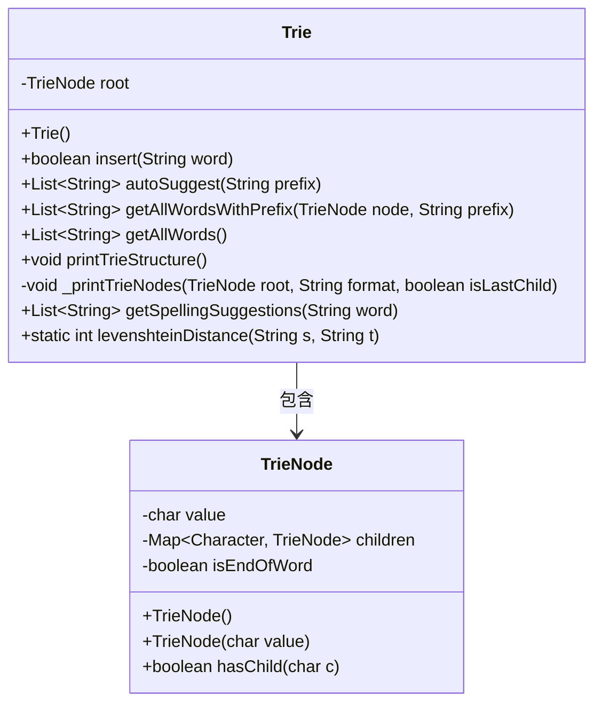
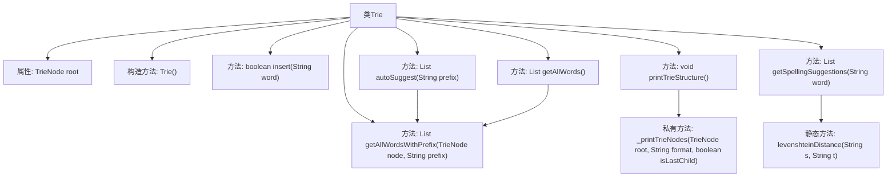

# 基础信息

|      |      |
|------|------|
| 名称 | Trie |
| 编码语言 | .java |
| 代码路径 | auto-suggest-java-demo/src/main/java/org/example/leansoftx/Trie.java |
| 包名 | org.example.leansoftx |
| 依赖项 | ['java.util'] |
| 概述说明 | Trie树实现，支持插入单词、前缀自动补全、拼写建议（基于编辑距离≤2）、打印树结构和获取所有单词功能。核心操作包括节点遍历和递归查询。 |

# 说明

该代码实现了一个字典树（Trie）数据结构，包含插入单词、自动补全建议、获取所有单词、打印树结构以及拼写建议功能。字典树由TrieNode节点构成，每个节点存储字符值和子节点映射。插入方法遍历单词字符构建节点链，自动补全通过前缀查找匹配单词。拼写建议使用编辑距离算法筛选相似词。打印方法以树形结构可视化字典树层级关系。

# 类列表 Class Summary

| 名称   | 类型  | 说明 |
|-------|------|-------------|
| Trie | class | Trie树实现，支持插入单词、前缀自动补全、拼写建议（基于编辑距离）及打印树结构功能。 |

## 类 Trie

|      |      |
|------|------|
| 访问范围 | public |
| 类型 | class |
| 名称 | Trie |
| 说明 | Trie树实现，支持插入单词、前缀自动补全、拼写建议（基于编辑距离）及打印树结构功能。 |

### UML类图

这段代码实现了一个Trie（前缀树）数据结构，用于高效存储和检索字符串。Trie类包含插入单词、自动补全建议、获取所有单词、打印树结构以及拼写建议等功能。TrieNode是内部节点类，存储字符值、子节点映射和单词结束标志。核心算法包括前缀匹配和Levenshtein距离计算，用于拼写纠错。该结构特别适合字典类应用，能快速处理前缀搜索和相似词推荐。

### 内部方法调用关系图

这段代码实现了一个Trie数据结构，用于高效存储和检索字符串。主要功能包括插入单词、自动补全建议、获取所有单词、打印Trie结构以及拼写建议。其中levenshteinDistance方法计算编辑距离用于拼写纠错，_printTrieNodes私有方法递归打印树形结构。流程图清晰展示了类成员关系和方法调用链。

### 字段列表 Field List

| 名称  | 类型  | 说明 |
|-------|-------|------|
| root | TrieNode | 私有成员变量root，表示Trie树的根节点。 |

### 方法列表

| 名称  | 类型  | 说明 |
|-------|-------|------|
| getAllWordsWithPrefix | List<String> | 方法getAllWordsWithPrefix接收TrieNode和前缀字符串，返回匹配前缀的单词列表，当前返回null需实现。 |
| getAllWords | List<String> | 获取所有单词列表，调用带前缀的辅助方法从根节点开始递归查询。 |
| autoSuggest | List<String> | 方法根据前缀在字典树中搜索匹配的单词。若前缀不存在返回空列表，否则返回所有匹配单词。 |
| getSpellingSuggestions | List<String> | 该方法获取单词的拼写建议：根据首字母前缀匹配词库中的单词，计算与输入单词的编辑距离（≤2），返回符合条件的建议列表。 |
| insert | boolean | 该代码实现了一个字典树的插入操作，遍历单词字符，若无子节点则创建，最后标记单词结束并返回插入成功状态。 |
| _printTrieNodes | void | 递归打印Trie树节点，按字母排序子节点，用符号表示层级关系。 |
| levenshteinDistance | int | 计算两个字符串的编辑距离，通过动态规划实现，返回最少操作次数（插入、删除、替换）。 |
| printTrieStructure | void | 方法printTrieStructure用于打印Trie树结构，先输出根节点，再递归打印子节点结构。 |

