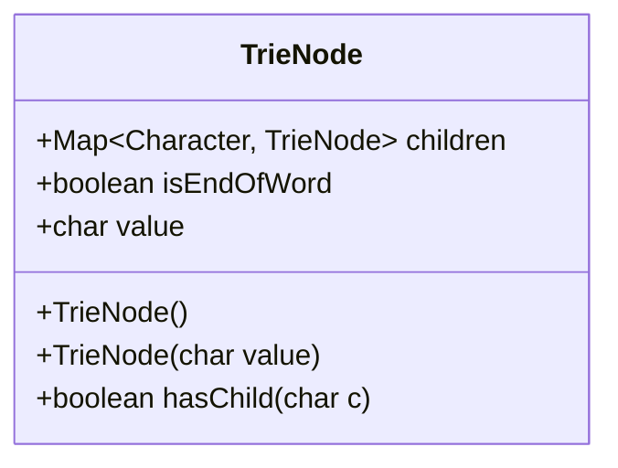
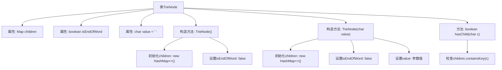

# 基础信息

|      |      |
|------|------|
| 名称 | TrieNode |
| 编码语言 | .java |
| 代码路径 | auto-suggest-java-demo/src/main/java/org/example/leansoftx/TrieNode.java |
| 包名 | org.example.leansoftx |
| 依赖项 | ['java.util.HashMap', 'java.util.Map'] |
| 概述说明 | TrieNode类表示字典树节点，包含子节点映射、是否单词结束标志和字符值，提供构造方法和检查子节点存在的方法。 |

# 说明

该内容描述了一个TrieNode类，用于实现字典树数据结构。类包含三个成员变量：children是一个映射字符到子节点的Map，isEndOfWord标记是否为单词结尾，value存储当前节点的字符值。提供了两个构造函数：无参构造函数初始化空子节点映射和默认值；带参构造函数可设置字符值。还包含一个方法hasChild，用于检查是否存在指定字符的子节点。整个类结构支持字典树的基本操作需求。

# 类列表 Class Summary

| 名称   | 类型  | 说明 |
|-------|------|-------------|
| TrieNode | class | TrieNode类表示字典树节点，包含子节点映射、字符值和单词结束标志，提供检查子节点存在的方法。 |

## 类 TrieNode

|      |      |
|------|------|
| 访问范围 | public |
| 类型 | class |
| 名称 | TrieNode |
| 说明 | TrieNode类表示字典树节点，包含子节点映射、字符值和单词结束标志，提供检查子节点存在的方法。 |

### UML类图

这段代码定义了一个TrieNode类，用于实现字典树（Trie）数据结构。该类包含三个主要成员变量：children是一个映射表，用于存储字符到子节点的对应关系；isEndOfWord标记当前节点是否为一个单词的结束；value存储当前节点代表的字符值。类提供了两个构造函数（默认构造和带字符参数的构造）以及一个hasChild方法用于检查是否存在指定字符的子节点。这个类是实现字典树的基础节点结构，通过children映射表实现高效的字符检索和单词存储功能。

### 内部方法调用关系图

该流程图展示了TrieNode类的结构和主要方法调用关系。类包含3个属性和2个构造方法，其中无参构造初始化空HashMap和默认值，带参构造额外设置字符值。hasChild方法通过检查children映射判断子节点存在性，适用于字典树(Trie)数据结构实现。

### 字段列表 Field List

| 名称  | 类型  | 说明 |
|-------|-------|------|
| children | Map<Character, TrieNode> | 类中定义了一个公共的Map类型变量children，键为Character，值为TrieNode。 |
| isEndOfWord | boolean | 变量isEndOfWord表示是否为单词结尾，布尔类型。 |
| value = ' ' | char | 声明一个公共字符变量value，初始值为空格。 |

### 方法列表

| 名称  | 类型  | 说明 |
|-------|-------|------|
| hasChild | boolean | 检查字符c是否为子节点键值，存在返回true，否则false。 |

